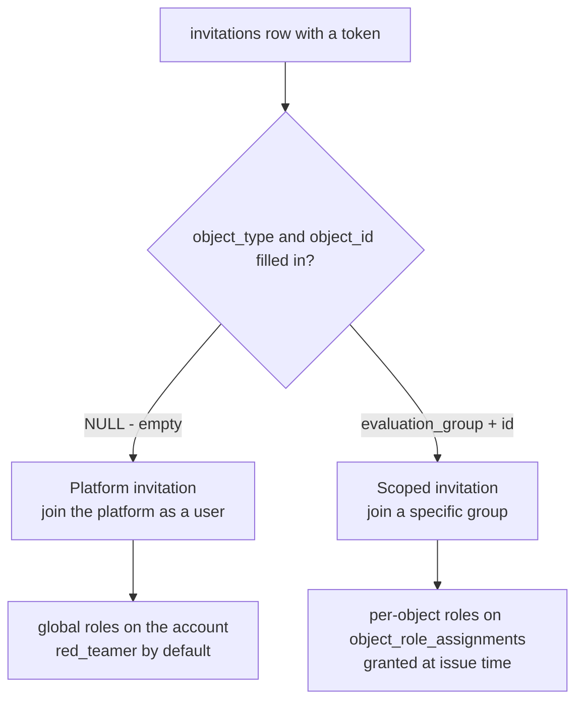
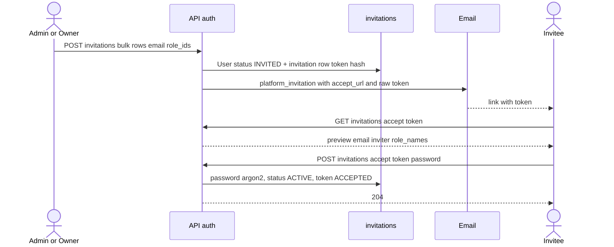

# Invitation

An invitation is a row in the `invitations` table with a token. Someone sends you a link, you click it, you provide a password, and your account becomes active. This is the onboarding mechanism for accounts provisioned by someone else (an admin or a group owner), as opposed to self-signup (where you register yourself).

A single invitation handles two cases: a **platform** invitation (join the platform) and a **group-scoped** invitation (join a specific evaluation group). The difference is one field: whether `object_type`/`object_id` is filled in.

## Why this exists

- The account is created by an admin or a group owner before the user has ever seen the platform. The user receives an email with a link, clicks it, sets a password. That is how the account moves from status `INVITED` to `ACTIVE`.
- The token is the only credential in this flow. The invitation preview and acceptance endpoints are **unauthenticated** (there is no JWT yet, because the account has no password).

## Data model

Table `invitations`, file `app/core/auth/models.py`. Inherits from `BaseModel` (`id`, `created_at`, `updated_at`, `deleted_at`).

| Column | Type | What for |
|---|---|---|
| `user_id` | UUID FK -> `users.id`, CASCADE | who is being invited (the account already exists, status `INVITED`) |
| `token_hash` | VARCHAR(64) | `sha256(raw_token)` - the raw token NEVER reaches the DB |
| `expires_at` | TIMESTAMPTZ | expiry, default 7 days (`invitation_ttl_hours=168`) |
| `revoked_at` | TIMESTAMPTZ NULL | revocation |
| `accepted_at` | TIMESTAMPTZ NULL | when it was accepted |
| `invited_by_user_id` | UUID FK -> `users.id` NULL | who invited (attribution) |
| `status` | `invitationstatus` | `pending` / `accepted` / `expired` / `revoked` |
| `object_type` | `objecttype` NULL | scope: object type (today only `evaluation_group`) |
| `object_id` | UUID NULL | scope: object id, **polymorphic, NO FK** |

Index: `ix_invitations_token_hash` UNIQUE partial `WHERE deleted_at IS NULL` (a soft-deleted invitation does not block a new token).

### Key point: the role is NOT on the invitation

The invitation carries a **scope** (where), not a **role** (with what permissions). Roles live on a separate table `object_role_assignments` (see [ObjectRoleAssignment](object-role-assignment.md)) and are granted right when the group invitation is issued. For a new account these roles are inert (dead) until activation - but they are already stored, so a pending invitee shows up on the group's member list.

### object_id without an FK

`object_id` is a polymorphic relation - it points at different tables depending on `object_type`. Postgres does not enforce integrity here. The application enforces it (e.g. soft-deleting invitations when an object is removed). Today the only `ObjectType` is `evaluation_group`.

## Platform vs group-scoped

| Trait | Platform | Group-scoped |
|---|---|---|
| `object_type` / `object_id` | NULL | `evaluation_group` + group UUID |
| Who issues | gate `users:invite` | gate `evaluation_groups:manage_members` (group owner) |
| Issuing code | `invite_to_platform` (`app/core/auth/services/invitations.py`) | `invite_to_group` (`app/core/evaluations/services/group_invitations.py`) reuses `create_object_invitation` |
| Source of roles in preview | account's global roles | `held_roles` from the assignment table |
| Issue endpoint | `POST /api/v1/auth/invitations/bulk` | `POST /api/v1/evaluation-groups/{id}/invitations/bulk` |
| Email (template) | `platform_invitation` | `evaluation_group_invitation` |

Both issue paths are **bulk-only**: the envelope *is* the invite path, so a single invitee is a one-row request. Up to `MAX_INVITE_ROWS` (100) rows, duplicate emails rejected as 422, per-row outcomes in `results[].error` (409 for an incompatible user state, 400 for an unknown role, 403 for a role the caller may not grant), and `dry_run=true` rolls back and mails nothing. The two envelopes deliberately share the cap and the duplicate rule — they feed one operator action, so a limit that differed would surface as the same dialog accepting a CSV here and rejecting it there. Every mail of one request carries a shared `batch_key`, so a provider outage notifies the inviter once instead of per recipient (see [Email](../components/email.md)).

Issuing is **scope-aware**: `_revoke_pending_invitations` treats the platform scope (`object_type IS NULL`) and each object scope independently. Re-issuing a group invitation does not cancel the platform invitation and vice versa.

## Resend and revoke

Beside issuing, an `invited` account's platform invitation can be managed from the user surface (both gated on `users:invite`, both additionally requiring the elevated permission for any elevated role the target holds):

| Action | Route | Effect |
|---|---|---|
| Resend | `POST /api/v1/auth/users/{id}/invitation/resend` | `reissue_platform_invitation(..., inviter=caller)` — revoke pending, mint a fresh token, re-mail it **attributed** to the admin. Roles untouched, so no grantability re-check. 409 unless status is `invited`. |
| Revoke | `DELETE /api/v1/auth/users/{id}/invitation` | `revoke_platform_invitation` — the pending row goes `REVOKED`; the `User` row stays. 404 when nothing is pending. |

`reissue_platform_invitation` has **two callers, one mechanic**: self-service (`inviter=None`, from the `/register` INVITED arm — no inviter recorded, the mail carries no name) and this admin resend (`inviter` supplied — the row records the admin and the mail names them). See [User management](../components/user-management.md).

### Lock order: users, then invitations

Accept, admin resend, admin revoke, and the `/register` INVITED arm each take `SELECT … FOR UPDATE` on the **user row** before touching invitation rows. Two reasons, both load-bearing:

- The thing these operations race over is the invitation **set** ("revoke whatever is pending", "re-issue"), and a set has no row to lock. The user row is the only mutex that covers it — without it, two callers each lock over `status = PENDING`, the second has its row dropped by the re-check when the first commits, and then acts on a set it never saw (revoke reporting "nothing pending" over an accept link just minted).
- A consistent order is what keeps these paths from deadlocking each other; Postgres aborts one side of an AB-BA with a 500, which on the invitee's accept page would be the accept.

**Known gap:** the re-invite arm of `invite_to_platform` (and its group sibling) still mutates the pending set holding only the invitation-row locks — `get_user_by_email` takes no user lock — so it can race the four paths above. Closing it means locking the user row there too *and* first deciding a row order for bulk batches (two batches locking overlapping users in different order would AB-BA). Tracked as a follow-up; don't copy the pattern.

## Link to account onboarding

The invitation by itself activates nothing. Acceptance flips the account to `ACTIVE`:

- `accept_invitation(...)` in `app/core/auth/services/invitations.py`.
- The token lookup is **unlocked** — it only resolves *which account to lock*. Then the user row goes `FOR UPDATE` and the invitation is re-read under both locks before anything is written, so a revoke or re-issue landing in that window is seen rather than overwritten. Concurrent accepts of the same token serialize on the user row: the second re-reads the now-`ACCEPTED` status and gets a 410. `project_expired` turns an overdue PENDING into EXPIRED without a write; non-PENDING -> 410.
- Requires `user.status in (INVITED, PENDING)` - otherwise 410. Why: re-accepting an `ACTIVE` account would overwrite the password, i.e. a stale token would act like an unauthenticated password reset.
- On success: sets the password (argon2), `status=ACTIVE`, `email_verified_at=now`, optionally names, token -> `ACCEPTED`. Best-effort `account_activated` email.
- Scoped roles are pre-assigned at issue time, so acceptance by itself grants no role.

**Two onboarding paths besides accept**: a group-scoped invitation can be consumed without clicking the invite link. A user who **self-signs-up** while a group invitation is already pending for them activates via email verification, and that path sweeps the live invitation to `ACCEPTED` (`accept_pending_invitations`). And an `INVITED` account that **re-registers** (its invite went unused) gets **no** password from the email-only request — registration re-issues the platform invitation instead (`reissue_platform_invitation`), an account-takeover guard. See [Authentication (auth)](../components/authentication.md).

## Other tokens alongside invitations

The invitation is one of three token tables. The rest are `email_verifications` (email verification on self-signup) and `password_reset_tokens` (password reset) - see [Support tables (email, verification, reset)](support-tables-email-verification-reset.md). All three share helpers from `app/core/auth/services/tokens.py`: `generate_raw_token`, `hash_token`, `project_expired`. The invitation is separate from email verification because it has a different lifecycle: it has an inviter, can be re-issued, carries a scope.

## Related

- [Authentication (auth)](../components/authentication.md)
- [Flow - evaluation group invitation](../flows/flow-evaluation-group-invitation.md)
- [ObjectRoleAssignment](object-role-assignment.md)
- [Object roles - per-object permissions](../components/object-roles-per-object-permissions.md)
- [User and Role](user-and-role.md)
- [EvaluationGroup](evaluation-group.md)
- [Support tables (email, verification, reset)](support-tables-email-verification-reset.md)
- [Email](../components/email.md)
- [Data model overview](data-model-overview.md)
