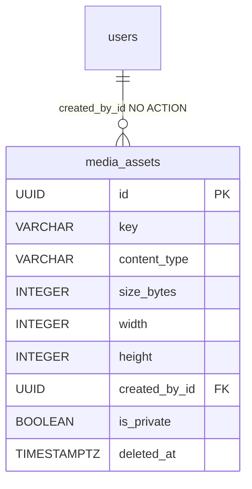

# MediaAsset

The record of one uploaded image blob — a cover, avatar or icon. It tracks where the bytes live (`key`), what they are (`content_type` + post-resize `width`/`height`/`size_bytes`) and who uploaded them (`created_by_id`). The bytes themselves sit in a swappable storage backend; the referencing entity (e.g. `Evaluation.cover_image`) stores only the opaque `key`.

Table: `media_assets`, model: `app/core/media/models.py`. Component note: [Media (image upload & serving)](../components/media-images.md).

## What it is for

Uploads are decoupled from whatever references them. A caller uploads an image and gets back a `key`; some other row (a cover, an avatar) then stores that `key` as a plain string — there is no FK from the referencing entity to `media_assets` and no back-reference the other way. The asset is the metadata + the capability handle; the storage backend holds the pixels.

## Columns

Inherits `BaseModel` (`id` UUID, `created_at`, `updated_at`, `deleted_at` soft-delete). Beyond that:

| Column | Type | Notes |
|---|---|---|
| `key` | VARCHAR(1024) NOT NULL | opaque storage key, **unique + indexed**; embeds the row id (see below); no backend prefix |
| `content_type` | VARCHAR(128) NOT NULL | sniffed media type (`image/jpeg` / `image/png` / `image/webp`) |
| `size_bytes` | INTEGER NOT NULL | byte size **after** resize |
| `width` | INTEGER NOT NULL | pixel width after resize |
| `height` | INTEGER NOT NULL | pixel height after resize |
| `created_by_id` | UUID NOT NULL FK → `users.id` | uploader; no `ON DELETE` (NO ACTION), indexed — a cover must outlive its uploader |
| `is_private` | BOOLEAN NOT NULL, default `false` | set at upload, **immutable**; a private asset 404s on the bare-key GET and serves via user-bound signed URLs only |

Table: `media_assets`. The `key` format is `{YYYY/MM/DD}/{id.hex}.{ext}` in UTC (e.g. `2026/07/09/a1b2…6666.png`) — dense date folders, the asset's own id as the filename, no storage-backend prefix (the adapter re-applies its own).

## Soft-delete, no back-reference

`DELETE /images/{key}` soft-deletes the row (uploader-only) then best-effort deletes the blob. There is deliberately **no back-reference check** — a still-referenced key (an evaluation cover) simply resolves to a clean 404 after deletion. Orphan GC is the beat-scheduled `reap_orphaned_media`: a live asset past the grace period (default 7 days) that no consumer references (today: `evaluations.cover_image` + `message_images.image_key`) is soft-deleted and its blob removed — see [Media (image upload & serving)](../components/media-images.md).

## Relationships

No FK points **at** `media_assets`: consumers (like `evaluations.cover_image`, a nullable `VARCHAR(1024)`, or `message_images.image_key`) hold the opaque `key` as a string, matching the generic-store design.

## Related

- [Media (image upload & serving)](../components/media-images.md) — the storage port, Pillow pipeline, signed URLs, private assets, orphan GC, and API
- [Evaluation](evaluation.md) — `cover_image` stores a media `key` (no FK)
- [Message](message.md) — `message_images` attachment rows store media keys (no FK)
- [User and Role](user-and-role.md) — `created_by_id` (uploader)
- [Data model overview](data-model-overview.md) — the full ERD
