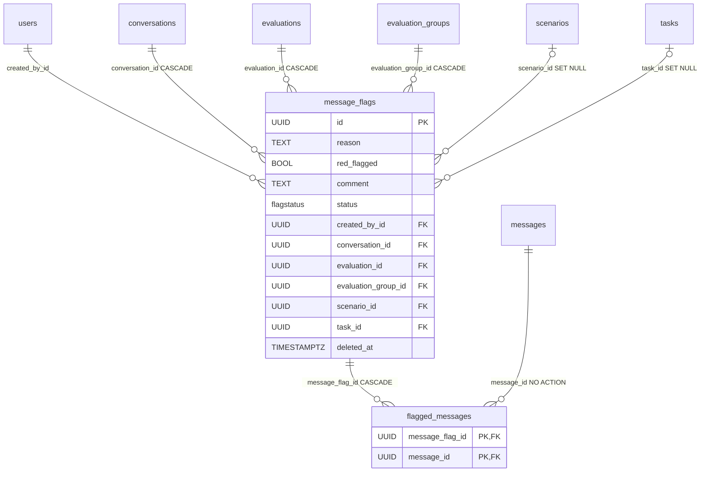

# MessageFlag

A flag marks a choice of [Message](message.md) in a conversation as "worth exploiting" — the red-teamer asserts that the model's response can be exploited, and describes why. It's the first-class citizen of the `annotations` context. Component-wise this is described by [Message flags](../components/message-flags.md); here the model itself.

Two tables: `message_flags` (the flag itself) + `flagged_messages` (which messages it covers). Classes in `app/core/annotations/models.py`.

## message_flags

Inherits `BaseModel` (`id`, `created_at`, `updated_at`, `deleted_at`).

| Column | Type | FK | ON DELETE | Note |
|---|---|---|---|---|
| `reason` | TEXT | — | — | NOT NULL — why the choice is worth exploiting |
| `red_flagged` | BOOL | — | — | NOT NULL, default `true` — the red-teamer's assertion |
| `comment` | TEXT NULL | — | — | optional note, separate from `Message` |
| `status` | `FlagStatus` enum | — | — | NOT NULL, default `pending`, index — flag status (independent of [Review](review.md) rows) |
| `created_by_id` | UUID | `users.id` | — | flag author, NOT NULL, index |
| `conversation_id` | UUID | `conversations.id` | CASCADE | the flag's anchor |
| `evaluation_id` | UUID | `evaluations.id` | CASCADE | denormalized from the conversation |
| `evaluation_group_id` | UUID | `evaluation_groups.id` | CASCADE | denormalized from the conversation |
| `scenario_id` | UUID NULL | `scenarios.id` | SET NULL | denormalized, index |
| `task_id` | UUID NULL | `tasks.id` | SET NULL | optional link to the scenario's task, index |

Besides the per-column `index=True` (`status`, `created_by_id`, `scenario_id`, `task_id`), `__table_args__` adds three explicit indexes on the denormalized parents — `ix_message_flags_conversation_id`, `ix_message_flags_evaluation_id`, `ix_message_flags_evaluation_group_id` — for the review queue and analytics filters.

```python
class MessageFlag(BaseModel, table=True):
    __tablename__ = "message_flags"
    __table_args__ = (
        Index("ix_message_flags_conversation_id", "conversation_id"),
        Index("ix_message_flags_evaluation_id", "evaluation_id"),
        Index("ix_message_flags_evaluation_group_id", "evaluation_group_id"),
    )

    reason: str = Field(sa_type=Text, sa_column_kwargs={"nullable": False})
    red_flagged: bool = Field(default=True, sa_column_kwargs={"nullable": False, "server_default": text("true")})
    comment: str | None = Field(default=None, sa_type=Text)
    status: FlagStatus = Field(default=FlagStatus.PENDING, ...)
    created_by_id: uuid.UUID = Field(foreign_key="users.id", nullable=False, index=True)
    conversation_id: uuid.UUID = Field(foreign_key="conversations.id", nullable=False, ondelete="CASCADE")
    evaluation_id: uuid.UUID = Field(foreign_key="evaluations.id", nullable=False, ondelete="CASCADE")
    evaluation_group_id: uuid.UUID = Field(foreign_key="evaluation_groups.id", nullable=False, ondelete="CASCADE")
    scenario_id: uuid.UUID | None = Field(default=None, foreign_key="scenarios.id", ondelete="SET NULL", index=True)
    task_id: uuid.UUID | None = Field(default=None, foreign_key="tasks.id", ondelete="SET NULL", index=True)

    messages: list[Message] = Relationship(sa_relationship_kwargs={
        "secondary": "flagged_messages",
        "order_by": _MESSAGE_SELECTION_ORDER,   # created_at, MESSAGE_ROLE_ORDER, slot, id
        "viewonly": True,
    })
```

The selection is ordered oldest-first across turns and then by the **transcript's intra-turn key** — `created_at` alone would order a flagged exchange at random, because a turn's prompt and reply share the timestamp to the microsecond. The sort key is shared with [Note](note.md) (`_MESSAGE_SELECTION_ORDER` in the same module); see [Message](message.md) for `MESSAGE_ROLE_ORDER`. The `with_live(Message)` filter on the eager load is belt-and-braces — nothing soft-deletes a `Message`.

### FlagStatus enum

`StrEnum`, DB type `flagstatus`, a closed set:

| Value | Meaning |
|---|---|
| `pending` | initial state, the flag awaits review |
| `approved` | flag accepted |
| `rejected` | flag rejected |

Separate from `ReviewStatus` on [Review](review.md). Today `FlagStatus` is independent — individual reviewers' verdicts don't set it automatically (an aggregated flag verdict from reviews is future scope). Reviewing a flag is described by [Reviews - reviewer verdicts](../components/reviews-reviewer-verdicts.md).

### Denormalization of ancestors

`evaluation_id`, `evaluation_group_id`, `scenario_id` could be derived from `conversation_id`, but they're kept directly — written in `create_flag` from the conversation's context. Reason the same as with [Conversation](conversation.md): listing and filtering flags comes down to a single join, without walking the whole chain. Consistency is guaranteed by the service (it validates that the messages belong to the conversation, and `task_id` to its scenario).

### Soft-delete without its own hook

All three ancestor FKs (`conversation_id`, `evaluation_id`, `evaluation_group_id`) have DB-side `CASCADE`, and soft-deleting a parent hides the flag **via the visibility cascade**, with no dedicated hook: the service scopes queries through `join_visible_evaluation_group` + a live conversation, so a soft-deleted ancestor disappears from flag listings automatically. `scenario_id`/`task_id` with `SET NULL` only govern hard-delete (the scenario's tombstone stays linked).

## flagged_messages — the join table

Pure `SQLModel` (NOT `BaseModel`) — an association row, without `id`, timestamps and soft-delete. Like `user_roles`.

```python
class FlaggedMessage(SQLModel, table=True):
    __tablename__ = "flagged_messages"
    __table_args__ = (Index("ix_flagged_messages_message_id", "message_id"),)
    message_flag_id: uuid.UUID = Field(foreign_key="message_flags.id", primary_key=True, ondelete="CASCADE")
    message_id: uuid.UUID = Field(foreign_key="messages.id", primary_key=True)
```

Composite PK `(message_flag_id, message_id)` — both dedupes the selection and serves the `message_flag_id`-prefix load (eager-loading a flag's messages). The extra `ix_flagged_messages_message_id` index serves the reverse "which flags include this message?" lookup (the `message_id` list filter and `flag_counts_by_message`). Two deliberate differences in `ON DELETE`:
- `message_flag_id` → **CASCADE**: deleting a flag cleans up its association rows.
- `message_id` → **none (NO ACTION)**: blocks a hard delete of a flagged message (preserves the evidence). The domain runs on soft-delete anyway, so this is an extra safeguard.

## Relationship diagram



## Restore

`?deleted=true` lists the caller's tombstones inside `RESTORE_WINDOW_DAYS`, and `POST /api/v1/message-flags/{flag_id}/restore` revives one (audited as `flag.restore`), scoped to `deleted_by_id` unless the `evaluation_groups:manage` break-glass lifts it. A flag hidden behind a soft-deleted conversation reads as a 404. See [Restore - reading tombstones back](../components/restore-soft-deleted-items.md).

## Related

- [Message flags](../components/message-flags.md)
- [Note](note.md) — the same shape, without a review status or the ownership requirement
- [Review](review.md)
- [Reviews - reviewer verdicts](../components/reviews-reviewer-verdicts.md)
- [Message](message.md)
- [Conversation](conversation.md)
- [Evaluation domain](../components/evaluation-domain.md)
- [RBAC - global roles](../components/rbac-global-roles.md)
- [Data model overview](data-model-overview.md)
