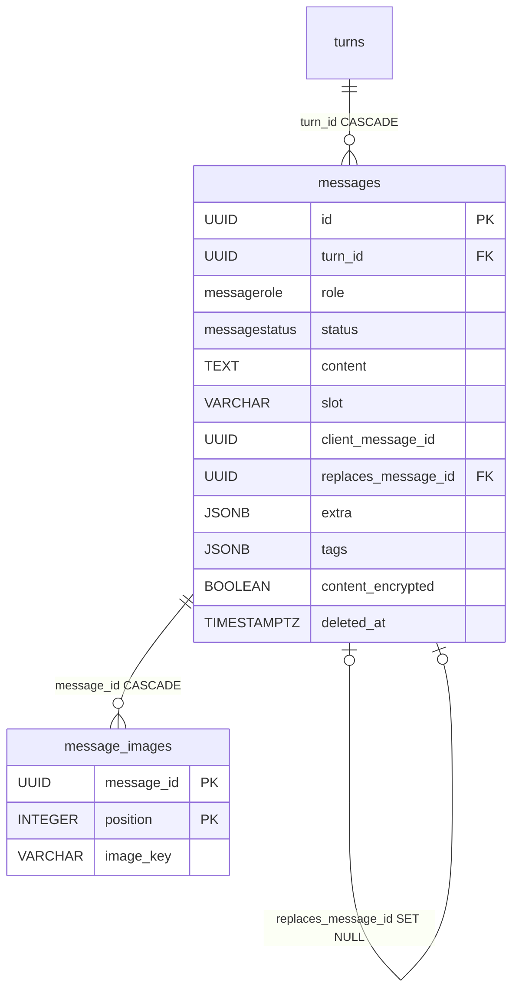

# Message

A single message within a [Turn](turn.md) — a user prompt, an assistant response, or a system note. This is the durable conversation history: here lands the content that the stateless streaming ([Streaming SSE](../components/streaming-sse.md)) merely passes through without persisting.

Table: `messages`, class `Message` in `app/core/conversations/models.py`. The core of the **write-path** — `POST .../messages` (+ `/regenerate`, `/continue`) opens a turn, persists the user message + an assistant placeholder and finalizes it after the stream (see [Message persistence (write-path)](../components/message-persistence-write-path.md)). On the **read** side: `GET .../conversations/{cid}/messages` returns them as `MessageResponse` — the bottom of a three-level schema chain `MessageBase` → `TranscriptMessage` (adds `turn_id`, `replaces_message_id`, `image_keys`, `extra`) → `MessageResponse` (adds `flag_count`) — see [Conversations](../components/conversations.md).

## Data model

Inherits `BaseModel` (`id`, `created_at`, `updated_at`, `deleted_at`).

| Column | Type | FK | ON DELETE | Note |
|---|---|---|---|---|
| `turn_id` | UUID | `turns.id` | CASCADE | parent, NOT NULL, index |
| `role` | `MessageRole` enum | — | — | `user` / `assistant` / `system` |
| `status` | `MessageStatus` enum | — | — | `streaming` / `complete` / `interrupted` / `error` |
| `content` | TEXT | — | — | NOT NULL, default `""` (the placeholder starts empty). **Sometimes ciphertext** — see below |
| `content_encrypted` | BOOLEAN | — | — | NOT NULL, default `false` — whether `content` holds ciphertext |
| `slot` | VARCHAR(8) NULL | — | — | branch label in dual/multi-model mode (`a`, `b`...) |
| `client_message_id` | UUID NULL | — | — | idempotency of the user's send (partial unique) |
| `replaces_message_id` | UUID NULL | `messages.id` | SET NULL | self-FK: regenerate/continue, linear history |
| `extra` | JSONB | — | — | NOT NULL, default `{}` — generation metadata (finish_reason, usage, error) + the recorded `tag_context` |
| `tags` | JSONB | — | — | NOT NULL, default `{}` — per-request prompt context, authored on the user message |

```python
class Message(BaseModel, table=True):
    __tablename__ = "messages"
    __table_args__ = (
        Index("ix_messages_client_message_id", "client_message_id", unique=True,
              postgresql_where=text("client_message_id IS NOT NULL")),
        Index("ix_messages_streaming", "created_at", postgresql_where=text("status = 'streaming'")),
        Index("ix_messages_replaces_message_id", "replaces_message_id", unique=True,
              postgresql_where=text("replaces_message_id IS NOT NULL")),
    )

    turn_id: uuid.UUID = Field(foreign_key="turns.id", nullable=False, ondelete="CASCADE", index=True)
    role: MessageRole = Field(...)
    status: MessageStatus = Field(...)
    content: str = Field(default="", sa_type=Text, sa_column_kwargs={"nullable": False})
    slot: str | None = Field(default=None, max_length=8)
    client_message_id: uuid.UUID | None = Field(default=None)
    replaces_message_id: uuid.UUID | None = Field(default=None, foreign_key="messages.id", ondelete="SET NULL")
    extra: dict[str, Any] = Field(default_factory=dict, sa_type=JSONB, ...)
    tags: dict[str, str] = Field(default_factory=dict, sa_type=JSONB, ...)
```

## `content` is sometimes ciphertext

A conversation created under a data licence with `protects_conversation_data` carries `Conversation.content_protected`, and every message write then routes its text through `seal_content`. The discriminator is **per row**, not per conversation:

```python
content_encrypted: bool = Field(default=False, ...)
```

A protected conversation still stores **empty** text as-is (`seal_content` leaves it unsealed), so its `streaming` placeholders and error rows are unsealed while its real messages are sealed. Never read `content` directly — every reader goes through `unseal_content`, keyed on this row's own flag. Full mechanism, key handling and rotation: [Conversation content sealing](../components/conversation-content-sealing.md).

`tags` and the recorded `tag_context` are **not** sealed: they are user-authored text riding the same exports.

## The recorded `tag_context`

Two `extra` keys record what a reply's prompt actually carried, so a transcript read back later doesn't show today's tags against yesterday's answer:

| Key | Meaning |
|---|---|
| `tag_context` | the sanitised tag pairs this reply's prompt carried |
| `tag_context_partial` | set only alongside a non-empty `tag_context`; the map covers only a `continue`'s appended continuation |

`recorded_tag_context(message)` is the single reader — `None` means *undecidable* (a user message, a reply older than the record, a finalize that never ran), which is not the same as an empty map. Both surface on `MessageBase`. See [Conversation tags](../components/conversation-tags.md).

## Per-message tags

`tags` is the per-request layer of the [tagging](../components/conversation-tags.md) feature: free-form `key: value` context authored with a single send, merged **over** the conversation's map (message wins per key) and folded into the model's system prompt for that request. Only user messages carry them; a regenerate/continue re-reads the tags of the turn's originating user message, so re-answering the same prompt uses the same context the transcript still shows. Surfaced as `tags` on `TranscriptMessage` and embedded in the message-carrying exports.

Unlike the conversation layer, an authored tag *is* validated at send time (400 when the evaluation disables tagging or restricts the key) — but a **replayed** send (idempotent retry on `client_message_id`) is not re-judged, and the stored map is filtered rather than rejected at the fold.

## Enums

Both `StrEnum`, stored in the database as lower_snake values (types `messagerole` / `messagestatus`). Closed sets — adding a value is an `ALTER TYPE` migration.

| Enum | Values | What for |
|---|---|---|
| `MessageRole` | `user`, `assistant`, `system` | message sender |
| `MessageStatus` | `streaming`, `complete`, `interrupted`, `error` | state of the assistant placeholder over its lifecycle |

Status lifecycle: the assistant starts as `streaming` (placeholder), and once the stream is exhausted `finalize_message` flips it to `complete` (or `error` on a provider error). `interrupted` is a message abandoned by regeneration **or** a placeholder after a hard worker crash that the reaper cleaned up (`reap_orphaned_streaming_messages`, marker `interrupted_by: reaper` in `extra` — see [Celery workers](../components/celery-workers.md)). User/system are `complete` right away.

## Three partial indexes — what each is for

- **`client_message_id` (unique WHERE NOT NULL)** — idempotency: the same `client_message_id` from the client does not create a second turn. Many NULLs allowed, non-null is unique.
- **`replaces_message_id` (unique WHERE NOT NULL)** — guarantees a **linear history**: each message has at most one successor. Regenerate/continue builds the chain through the self-FK.
- **`created_at` (WHERE status = 'streaming')** — backs the reaper scan (`reap_orphaned_streaming_messages`) that cleans up placeholders stuck after a hard worker crash (finalize didn't run). See [Celery workers](../components/celery-workers.md).

## Self-FK: regenerate and continue

`replaces_message_id` is a self-reference Message → Message. When a red-teamer regenerates a response, the new placeholder points via `replaces_message_id` at its predecessor, and the predecessor (if still `streaming`) is flipped to `interrupted`. `SET NULL` on a hard delete of the older row keeps the history consistent. The `live_turn_messages` service filters out superseded messages, to show only the current branch.

## Image attachments — `message_images`

A user message can carry up to 5 image attachments for a vision-capable model. They live in the `message_images` link table (`MessageImage`), a plain association row like `flagged_messages` — **not** a `BaseModel` (its lifecycle is bound to the message, so no `id`/timestamps/`deleted_at`):

```python
class MessageImage(SQLModel, table=True):
    __tablename__ = "message_images"

    message_id: uuid.UUID = Field(foreign_key="messages.id", primary_key=True, ondelete="CASCADE")
    position: int = Field(primary_key=True)
    image_key: str = Field(max_length=1024)
```

- Composite PK `(message_id, position)`; `position` preserves the user's attachment order — the order the parts are replayed to the model on every (re)dispatch.
- `image_key` is an opaque [MediaAsset](media-asset.md) storage key, **no FK** to `media_assets` — decoupled like every other media consumer. The write-path validates each key is the caller's own **private** upload; the history rebuild inlines the blobs as `data:` URLs and drops a since-vanished blob with a warning (see [Message persistence (write-path)](../components/message-persistence-write-path.md)).
- Read projections surface the keys as `image_keys` (attachment order, `[]` when none) via the batched `image_keys_for_messages` lookup — one query per page, the message row itself carries nothing.

## Relations by FK only

Like [Turn](turn.md) — Message **has no explicit `Relationship`** or `back_populates`. Everything goes by FK at the database level. This is deliberate: the service itself decides the soft-delete filter and the sort order (by `role`, `slot`, `id` — not by `created_at`).

The intra-turn sort key is published as `MESSAGE_ROLE_ORDER` on the model module, so every reader shares one definition:

```python
MESSAGE_ROLE_ORDER = case(
    {MessageRole.USER: 0, MessageRole.SYSTEM: 1, MessageRole.ASSISTANT: 2},
    value=col(Message.role),
    else_=9,
)
```

`created_at` cannot order a turn's messages — the prompt and its reply are written in one transaction, so `now()` gives them the same value to the microsecond and the `id` (uuid4) tiebreak would decide at random. Every reader pairs this with `slot`, then `id`; a role absent from the map sorts last, so **the map must grow with `MessageRole`**. Besides the transcript queries in `services/messages.py`, the message-selection projections of [MessageFlag](message-flag.md) and [Note](note.md) order by it too, so a flagged or annotated exchange reads the same way as the transcript.

## Relationship diagram



## Related

- [Turn](turn.md)
- [Conversation](conversation.md)
- [Message persistence (write-path)](../components/message-persistence-write-path.md)
- [Streaming SSE](../components/streaming-sse.md)
- [Celery workers](../components/celery-workers.md)
- [Conversations](../components/conversations.md)
- [Conversation tags](../components/conversation-tags.md)
- [Conversation content sealing](../components/conversation-content-sealing.md)
- [MessageFlag](message-flag.md)
- [Note](note.md)
- [MediaAsset](media-asset.md)
- [Media (image upload & serving)](../components/media-images.md)
- [Data model overview](data-model-overview.md)
