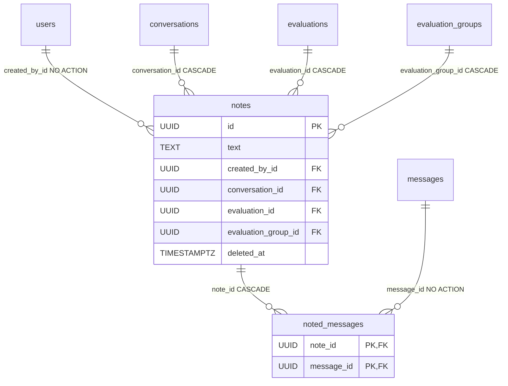

# Note

A free-text note an annotator attaches to a **selection** of one conversation's [messages](message.md). Independent of [MessageFlag](message-flag.md): the note stands whether or not a participant flagged the response, it carries no review status, and **its author need not own the conversation**. Component-wise this is [Notes](../components/notes.md); here the model itself.

Two tables: `notes` (the note) + `noted_messages` (which messages it covers). Classes in `app/core/annotations/models.py`, alongside `MessageFlag` — the module docstring states the ancestry invariant both share.

> **Renamed** from `Annotation` / `annotations` / `annotated_messages`, freeing the `annotation` name for the per-message label entity ([AnnotationLabel](annotation-label.md) is its vocabulary). The package is still `app/core/annotations/`.

## notes

Inherits `BaseModel` (`id`, `created_at`, `updated_at`, `deleted_at`, `deleted_by_id`).

| Column | Type | FK | ON DELETE | Note |
|---|---|---|---|---|
| `text` | TEXT | — | — | NOT NULL — the annotator's note (max 10 000 chars at the edge) |
| `created_by_id` | UUID | `users.id` | — (NO ACTION) | note author, NOT NULL, index |
| `conversation_id` | UUID | `conversations.id` | CASCADE | the note's anchor |
| `evaluation_id` | UUID | `evaluations.id` | CASCADE | denormalized from the conversation |
| `evaluation_group_id` | UUID | `evaluation_groups.id` | CASCADE | denormalized from the conversation |

`__table_args__` adds the three explicit indexes on the denormalized parents — `ix_notes_conversation_id`, `ix_notes_evaluation_id`, `ix_notes_evaluation_group_id` — which the flat list and its filters scope by.

```python
class Note(BaseModel, table=True):
    __tablename__ = "notes"
    __table_args__ = (
        Index("ix_notes_conversation_id", "conversation_id"),
        Index("ix_notes_evaluation_id", "evaluation_id"),
        Index("ix_notes_evaluation_group_id", "evaluation_group_id"),
    )

    text: str = Field(sa_type=Text, sa_column_kwargs={"nullable": False})
    created_by_id: uuid.UUID = Field(foreign_key="users.id", nullable=False, index=True)
    conversation_id: uuid.UUID = Field(foreign_key="conversations.id", nullable=False, ondelete="CASCADE")
    evaluation_id: uuid.UUID = Field(foreign_key="evaluations.id", nullable=False, ondelete="CASCADE")
    evaluation_group_id: uuid.UUID = Field(foreign_key="evaluation_groups.id", nullable=False, ondelete="CASCADE")

    messages: list[Message] = Relationship(
        sa_relationship_kwargs={
            "secondary": "noted_messages",
            "order_by": _MESSAGE_SELECTION_ORDER,
            "viewonly": True,
        }
    )
```

`created_by_id` deliberately carries **no** delete rule: users soft-delete, so a hard delete is refused and authorship can't silently vanish from the note.

### Differences from MessageFlag

Same shape, deliberately narrower content:

| | [MessageFlag](message-flag.md) | `Note` |
|---|---|---|
| Content columns | `reason` / `red_flagged` / `comment` / `status` | `text` only |
| Review workflow | yes — a flag is a "submission" ([Review](review.md)) | none |
| `scenario_id` / `task_id` | denormalized too | not carried |
| Author must own the conversation | yes (`resolve_conversation_context`) | **no** — visibility of the parent group is enough |

### Denormalization of ancestors

`evaluation_id` and `evaluation_group_id` are resolved once at create from the conversation, under the caller's visibility, so they can't drift — after that every read needs only the note's own columns. Same reasoning as [MessageFlag](message-flag.md) and [Conversation](conversation.md).

### Soft-delete without its own hook

All three ancestor FKs are DB-side `CASCADE`, and soft-deleting any of them hides the note **through the shared read scope** (`join_conversation_scoped` — the visibility spine plus a live parent conversation), with no dedicated cascade hook. That includes the conversation cascades wired for model-unassign / ai-model-delete.

### The message selection is fixed

`message_ids` is a **set** (not a contiguous range) and is chosen at create: a different selection is a new note, never an edit of this one. `NoteUpdate` is `extra="forbid"` precisely so sending `message_ids` fails loudly instead of being accepted and dropped.

## noted_messages — the join table

Pure `SQLModel` (NOT `BaseModel`) — an association row, without `id`, timestamps and soft-delete. Like `flagged_messages` and `user_roles`; its lifecycle is bound to the parent note.

```python
class NotedMessage(SQLModel, table=True):
    __tablename__ = "noted_messages"
    __table_args__ = (Index("ix_noted_messages_message_id", "message_id"),)
    note_id: uuid.UUID = Field(foreign_key="notes.id", primary_key=True, ondelete="CASCADE")
    message_id: uuid.UUID = Field(foreign_key="messages.id", primary_key=True)
```

Composite PK `(note_id, message_id)` both dedupes the selection and serves the `note_id`-prefix load; the extra `ix_noted_messages_message_id` index serves the reverse "which notes include this message?" filter. `ON DELETE` differs per side exactly as in `flagged_messages`:

- `note_id` → **CASCADE**: dropping a note drops its links.
- `message_id` → **none (NO ACTION)**: the database refuses to hard-delete a message any note references.

## Message ordering

Both selections (`MessageFlag.messages` and `Note.messages`) share one sort key, `_MESSAGE_SELECTION_ORDER` in `app/core/annotations/models.py`:

```python
_MESSAGE_SELECTION_ORDER = [
    col(Message.created_at),
    MESSAGE_ROLE_ORDER,
    col(Message.slot),
    col(Message.id),
]
```

`created_at` alone is not enough: a turn's prompt and its reply are written in one transaction and share it to the microsecond, so the `id` (uuid4) tiebreak would order a noted exchange at random — and differently from the transcript endpoint. `MESSAGE_ROLE_ORDER` (in `app/core/conversations/models.py`) is the intra-turn key user → system → assistant. See [Message](message.md).

## Relationship diagram



## Related

- [Notes](../components/notes.md)
- [AnnotationLabel](annotation-label.md) — the label vocabulary that took the `annotation` name
- [MessageFlag](message-flag.md) — the sibling with a review workflow
- [Message](message.md)
- [Conversation](conversation.md)
- [Reviews - reviewer verdicts](../components/reviews-reviewer-verdicts.md)
- [RBAC - global roles](../components/rbac-global-roles.md)
- [Restore - reading tombstones back](../components/restore-soft-deleted-items.md) — `?deleted=true` + `POST /notes/{id}/restore` (`notes:delete`)
- [Data model overview](data-model-overview.md)
