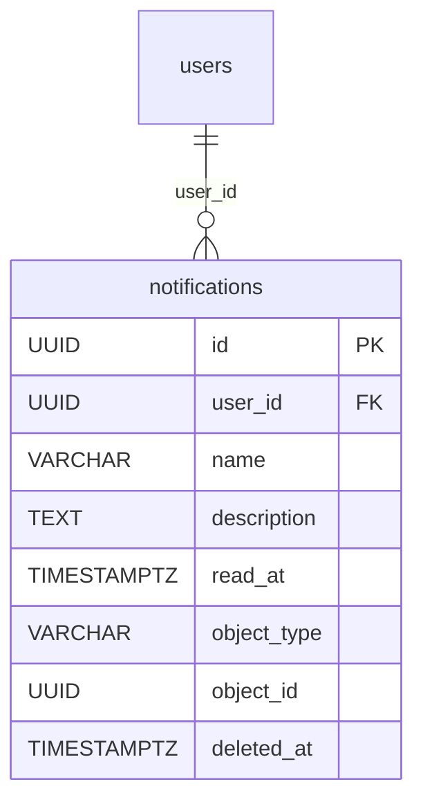

# Notification

One in-app message delivered to one user: a short `name`, an optional `description`, an optional pointer at the domain row it is about, and a read mark. The console's bell/badge/list reads this table.

Table: `notifications`, model: `app/core/notifications/models.py`. Component note: [Notifications (in-app feed)](../components/notifications.md).

## Columns

Inherits `BaseModel` (`id` UUID, `created_at`, `updated_at`, `deleted_at` soft-delete). Beyond that:

| Column | Type | Notes |
|---|---|---|
| `user_id` | UUID NOT NULL FK → `users.id` | the recipient; the whole owner scope hangs off it |
| `name` | VARCHAR(255) NOT NULL | short title, e.g. `Evaluation approved` |
| `description` | TEXT NULL | longer body text |
| `read_at` | TIMESTAMPTZ NULL | NULL = unread; the wire's `read` boolean is derived from it |
| `object_type` | VARCHAR(64) NULL | which model the notification points at — a plain string, validated at the edge |
| `object_id` | UUID NULL | id of that row; **no FK** |

There is no per-notification "kind" enum: the copy (`name` / `description`) is composed by the emitter.

## `object_type` / `object_id` — a loose reference, not an FK

The pair exists so the frontend can deep-link ("open the evaluation this is about"). It is deliberately **not** a foreign key: the target may be soft-deleted or gone by the time the user clicks, and a notification about a since-deleted row is still worth showing. `object_type` is validated against `NotificationObjectType` (`app/core/notifications/enums.py`) at the edge — today `evaluation`, `evaluation_group` and `ai_model` — and stored as text, so a new target type needs no migration.

> Renaming or removing an enum member is a **breaking read**: `NotificationResponse.from_model` calls `NotificationObjectType(row.object_type)`, so stale rows would raise. Migrate or purge them first — the same hazard as `SavedViewResource`.

## Index

One composite index, no standalone `user_id` one:

```python
Index("ix_notifications_user_id_created_at", "user_id", "created_at")
```

It serves the only read shape there is — the owner-scoped, newest-first list. The `read` filter is a **residual predicate** (`read_at` is not in the index), which is fine: a single user's feed is small.

## Lifecycle

1. A domain service calls `create_notification(...)` — unread, flushed but not committed, so it lands with the emitting transaction. (The email worker is the one exception: it runs on a sync session, so it inserts the row directly — see [Email](../components/email.md).)
2. The owner lists it (`GET /notifications`) or fetches it by id.
3. `POST /notifications/mark` stamps or clears `read_at`, touching only rows in the opposite state.

There is no HTTP create and no user-facing delete; `deleted_at` comes from `BaseModel` but nothing tombstones a notification today.

## Relationships



The `object_type` / `object_id` pair has no edge on the diagram — it is polymorphic and FK-less, like `object_role_assignments.object_id` and the whole `audit_logs` table.

## Related

- [Notifications (in-app feed)](../components/notifications.md) — service, emitters, endpoints, permissions
- [User and Role](user-and-role.md) — `user_id` (the recipient)
- [Evaluation](evaluation.md) / [EvaluationGroup](evaluation-group.md) — the two link targets
- [ExportJob](export-job.md) — the export completion announcement
- [SavedView](saved-view.md) — the sibling personal-data table
- [Data model overview](data-model-overview.md) — the full ERD
