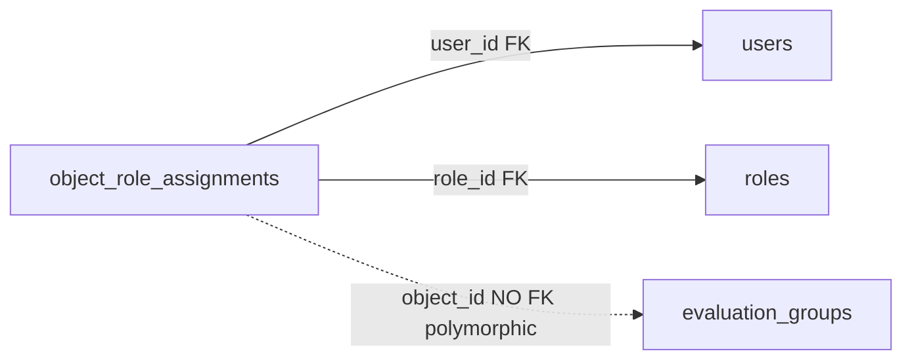

# ObjectRoleAssignment

The table that says "this user has these roles on this specific object". It grants permissions per single object, independently of the global roles from the JWT. Today the only object type is an evaluation group.

It is the **source of truth** for object roles. All the access-resolution logic reads rows from this table. The mechanism is an analog of django-guardian.

## Why this exists

The system has two disjoint authorization scopes:

1. **Global roles** — sit in the JWT, say what the user can do on the platform (see [RBAC - global roles](../components/rbac-global-roles.md)).
2. **Per-object roles** — sit in this table, say what the user can do on a specific group (see [Object roles - per-object permissions](../components/object-roles-per-object-permissions.md)).

The key rule: when a user holds **any** role on an object, the permissions of those roles are the user's **entire** effective set on that object. This is never merged with the global permissions from the JWT. The exception is the break-glass `evaluation_groups:manage`, which trumps this override.

## What this table is

`app/core/auth/object_roles/models.py`

`__tablename__ = "object_role_assignments"`. One row = one assignment `(object_type, object_id, user, role)`.

| Column | Type | FK | Notes |
|---|---|---|---|
| `object_type` | enum `objecttype` | none | today only `evaluation_group` |
| `object_id` | UUID | **no FK** | points at a different table depending on the type |
| `user_id` | UUID | `users.id` ON DELETE CASCADE | who holds the role |
| `role_id` | UUID | `roles.id` (no ondelete) | which role from the global catalog |

Plus the standard columns from `BaseModel`: `id`, `created_at`, `updated_at`, `deleted_at` (soft-delete).

## Why polymorphic and without an FK

`object_type` + `object_id` together point at the target. `object_type` says "which table", `object_id` says "which row". This is a polymorphic pattern — one assignment table handles different object types.

The cost: **there is no FK to the target**. The database does not enforce that `object_id` actually exists. Referential integrity is the application's responsibility. When an object is deleted, the application must clean up the assignments itself via `soft_delete_object_assignments`.

The dashed line to `evaluation_groups` is a loose binding — it does not exist in the database, only in the application's head.

## The role is reused from the global catalog

`role_id` points at the same `roles` catalog that global roles use. What a role **grants** at the object level is its `Role.permissions` — the same permission list as globally. There is no separate permission dictionary for object roles.

Consequence: a role such as the in-group `owner` nominally also carries platform permissions (e.g. `users:invite`) that mean nothing on a group. Accepted for the simplicity of a single permission set. What a role can **be granted** on a given object type is constrained by `assignable_roles` in `registry.py`.

## Two indexes

`models.py`

- `ix_object_role_assignments_object_user_role` — UNIQUE, **partial** `WHERE deleted_at IS NULL`. Only live rows are unique per `(object_type, object_id, user_id, role_id)`. Tombstones are excluded, so a deleted assignment can be added again. The leading columns also serve the access lookup per `(object, user)`.
- `ix_object_role_assignments_user_object_type` — `(user_id, object_type)`. Serves the group-visibility subquery in `app/core/evaluations/access.py` (fires on every listing) and the `ON DELETE CASCADE` cascade on `user_id`.

## How it is used

- **Group creation** — the domain grants the creator the in-group `owner` via `grant_roles`. That is how the creator controls the group: not by being the creator, but by the granted role. `created_by_id` on the group is only attribution, not authority.
- **Access read** — `resolve_object_access` reads the user's live roles on the object and builds an `ObjectAccessContext`.
- **Visibility** — the subquery in `access.py` treats every live assignment as read access (hence the invariant: every assignable role must grant `evaluation_groups:read`).
- **Member management** — `add_member` / `set_member_roles` / `remove_member` (soft-delete) from `service.py`. The last two enforce the type's `protected_role` invariant: dropping a group's sole live `owner` is rejected with **409**, and `objects_solely_held_by` extends the same check to user deletion (see [Object roles - per-object permissions](../components/object-roles-per-object-permissions.md)).

A liveness asymmetry to watch out for: visibility looks only at the live **assignment**, whereas authorization (`held_roles`) requires a live **role and assignment**. A member with a catalog-deleted role still sees the group on the listing but is rejected on operations (degrades safely toward less power).

## Pitfalls

| Pitfall | Effect |
|---|---|
| No FK on `object_id` | Integrity = application's responsibility; cascade via `soft_delete_object_assignments` |
| Unique index only on live rows | Re-add after deletion works; `add_member` catches both `IntegrityError` and explicitly checks live rows |
| `role_id` without ondelete | A role still assigned to an object cannot be hard-deleted |
| One permission dictionary | Platform permissions "hang" dead at the object level |
| Protected-role last holder | `set_member_roles` / `remove_member` / user-delete reject removing an object's sole live `owner` (409); the protected assignments are locked `FOR UPDATE` so concurrent drops serialize |

## Related

- [Object roles - per-object permissions](../components/object-roles-per-object-permissions.md)
- [User and Role](user-and-role.md)
- [EvaluationGroup](evaluation-group.md)
- [RBAC - global roles](../components/rbac-global-roles.md)
- [Invitation](invitation.md)
- [Data model overview](data-model-overview.md)
- [Evaluation domain](../components/evaluation-domain.md)
- [Flow - request authentication and authorization](../flows/flow-request-authentication-and-authorization.md)
- [Flow - evaluation group invitation](../flows/flow-evaluation-group-invitation.md)
