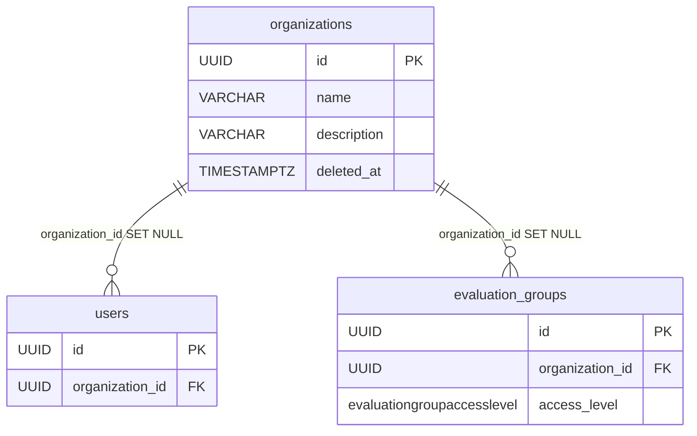

# Organization

The tenancy root: a flat, admin-managed entity that scopes users and evaluation groups. One organization is one tenant. It is deliberately minimal — a name and an optional description — because membership is a single FK, not a join table.

Table: `organizations`, model: `app/core/organizations/models.py`. Component note: [Organizations](../components/organizations.md).

## What it is for

Multi-tenancy on the platform. A [User](user-and-role.md) optionally belongs to one organization (`User.organization_id`), and an [EvaluationGroup](evaluation-group.md) can belong to one (`EvaluationGroup.organization_id`). The org is the unit that the `organization` access level scopes group visibility to — see [Evaluation domain](../components/evaluation-domain.md). Organizations are created and managed by platform admins only.

Both memberships are **nullable**: orgless accounts (self-signup, legacy) and orgless groups (`public` / `invitation_only` without a tenant) are valid and stay platform-wide in scope.

## Columns

Inherits `BaseModel` (`id` UUID, `created_at`, `updated_at`, `deleted_at` soft-delete). Beyond that:

| Column | Type | Notes |
|---|---|---|
| `name` | VARCHAR(255) NOT NULL | unique among live rows (partial index `ix_organizations_name WHERE deleted_at IS NULL`) |
| `description` | VARCHAR(1024) NULL | free text, clearable |

```python
class Organization(BaseModel, table=True):
    __tablename__ = "organizations"
    __table_args__ = (Index("ix_organizations_name", "name", unique=True, postgresql_where=text("deleted_at IS NULL")),)

    name: str = Field(max_length=255, nullable=False)
    description: str | None = Field(default=None, max_length=1024)
```

The partial unique index mirrors the `users.email` / `roles.name` pattern: a soft-deleted org doesn't block re-creating one with the same name.

## Membership: a nullable FK, not a join table

There is no `organization_members` table. Membership is the single `User.organization_id` FK (one user, one org), `ON DELETE SET NULL`:

```python
# app/core/auth/models.py
organization_id: uuid.UUID | None = Field(
    default=None,
    foreign_key="organizations.id",
    ondelete="SET NULL",
    nullable=True,
    index=True,
)
organization: Organization | None = Relationship()
```

Assigning a member is just stamping the FK (`assign_member`); removing is clearing it (`remove_member`). No object-role machinery is involved — that's a separate scope, see [Object roles - per-object permissions](../components/object-roles-per-object-permissions.md).

## Soft-delete reads as "no organization"

A **soft-deleted org reads as no organization** everywhere it is projected or matched. The authoritative rule is the projection guard `OrganizationBase.from_optional_live` (a many-to-one `with_live` doesn't reliably filter across identity-map states), mirrored in SQL by the visibility predicate's `Organization.deleted_at IS NULL` join. So `/auth/me`, `UserResponse`, and the `organization` access-level visibility all **fail-closed** on a tombstoned org.

## Delete is blocked while a live group references it

`soft_delete_organization` raises **409 ConflictError** when any live [EvaluationGroup](evaluation-group.md) still references the org. A soft-delete does **not** fire the FK `SET NULL` (that's hard-delete only), so a tombstoned org would otherwise leave its `organization`-access groups dark *and* un-editable (every group write re-validates a live `organization_id`). The operator must reassign or clear those groups first. Member *users* keep their `organization_id` pointing at the tombstone — benign, they fail-closed to orgless.

## Relationships



Both FKs are `SET NULL` on hard-delete; neither is on the soft-delete path (hence the 409 guard above for groups, and the fail-closed projection for users).

## Restore

`?deleted=true` on the list (403 without `organizations:delete`; every actor's deletes, no owner tier) plus `POST /api/v1/organizations/{organization_id}/restore` — **409** if a live org has taken the name.

Members need no repair: the delete leaves their `organization_id` pointing at the tombstone (reading as orgless meanwhile), so reviving the row re-resolves every pointer. And since the delete refuses while a live evaluation group still references the org, nothing was left dangling to fix. See [Restore - reading tombstones back](../components/restore-soft-deleted-items.md).

## Related

- [Organizations](../components/organizations.md) — the CRUD + membership service and the API
- [User and Role](user-and-role.md) — `User.organization_id` membership
- [EvaluationGroup](evaluation-group.md) — `organization_id` + the `organization` access level
- [Evaluation domain](../components/evaluation-domain.md) — how the `organization` access level scopes visibility
- [RBAC - global roles](../components/rbac-global-roles.md) — the `organizations:*` permission split
- [Data model overview](data-model-overview.md) — the full ERD
