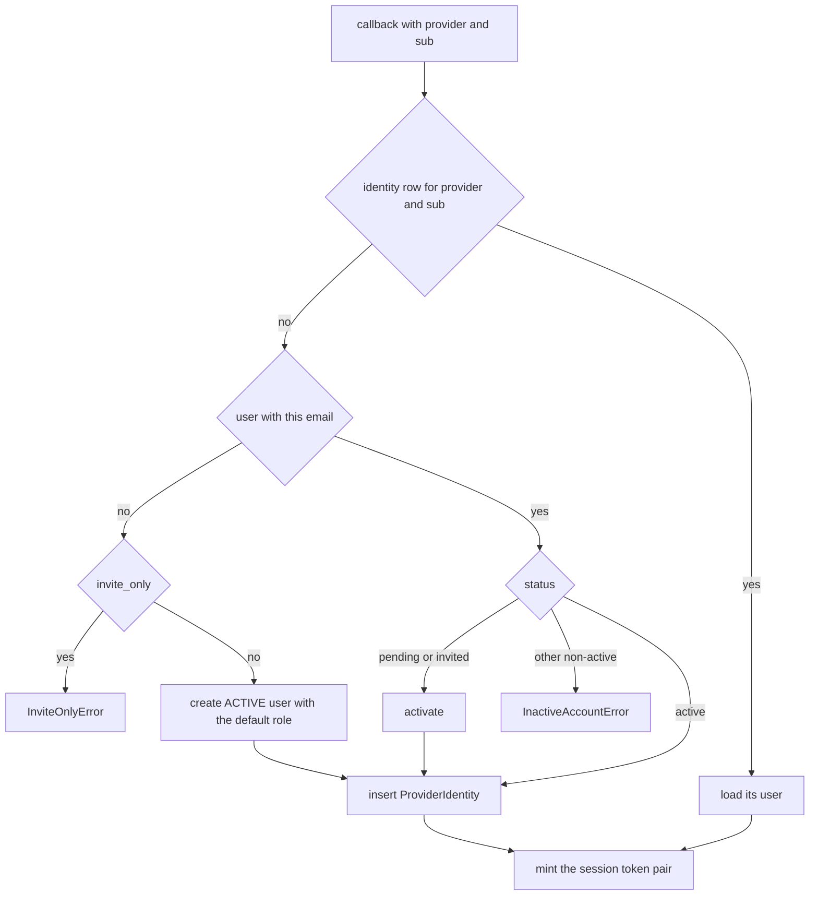

# ProviderIdentity

An external login identity linked to a local [User](user-and-role.md). One row per IdP account; linking a second mechanism to the same human is another row with the same `user_id`.

Table `provider_identities`, model in `app/core/auth/models.py`, resolution in `app/core/auth/services/oidc.py`.

> This used to be a **non-table DTO** with a `"local"` sentinel provider. It is now a real table, and only *external* logins write rows: a password login resolves its user by email and mints from the `User` row directly, with no row here.

## Columns

Beyond `BaseModel` (`id`, `created_at`, `updated_at`, `deleted_at`, `deleted_by_id`):

| Column | Type | Notes |
|---|---|---|
| `provider` | VARCHAR(64) NOT NULL | OIDC provider name — `google` today |
| `subject` | VARCHAR(255) NOT NULL | the IdP's stable user id (`sub`), **never** the email — an email can be reassigned at the provider, `sub` cannot |
| `user_id` | UUID NOT NULL FK → `users.id` `ON DELETE CASCADE`, idx | the local account |

One index, partial-unique, mirroring `ix_users_email`:

```python
Index(
    "ix_provider_identities_provider_subject",
    "provider",
    "subject",
    unique=True,
    postgresql_where=text("deleted_at IS NULL"),
)
```

Live rows only — so a soft-deleted identity doesn't block re-linking that IdP account later. That is exactly what makes a [user restore](../components/restore-soft-deleted-items.md) work without repairing identities: the delete cascades them to tombstones, they stay tombstoned, and the next external login simply inserts a fresh row.

## Resolution at login



Two races are handled with a **SAVEPOINT** rather than a pre-check, since both are ordinary double-clicks:

- concurrent first login for the same *email* — `create_user` raises `ConflictError` on the bare partial-unique-email violation, which without the savepoint would poison the whole transaction for the loser; the loser re-reads the winner's user;
- concurrent first login for the same *subject* — the loser adopts the winner's identity row rather than failing the login. The table has exactly one unique constraint, so a row existing afterwards is strong evidence this was that race; it is logged as `auth.oidc.identity_race_recovered` either way, because the swallow otherwise leaves no signal.

The status check runs **before** the link, so a deactivated account never collects an identity row on the way to being rejected.

## Activation clears the password

When the IdP vouches for a `pending` / `invited` account, `_activate` promotes it to `active` and **wipes any password on the row**. Without that, an attacker who self-registers the victim's email keeps a live credential once the victim's Google login activates the account.

`User.password_cleared_at` is stamped when a password was actually cleared. It is the only record of *why* the account is passwordless afterwards, which is what lets `request_password_reset` tell "recovering from a clear" apart from "never had one, pure IdP account" and reopen a local-login door only for the former. The `account_activated` mail carries the same distinction as `password_cleared`.

An `invited` account whose invitation was since revoked or has lazily expired is **refused** here — stricter than `register_user`'s `INVITED` branch, which reissues; there is no accept link to re-mint on this path.

## Related

- [Authentication (auth)](../components/authentication.md) — the OIDC endpoints, PKCE, the cookie, the error redirects
- [User and Role](user-and-role.md) — the account this points at, and `password_cleared_at`
- [Invitation](invitation.md) — the invitation an activation consumes
- [Restore - reading tombstones back](../components/restore-soft-deleted-items.md) — why the unique index is partial
- [Data model overview](data-model-overview.md) — the full ERD
