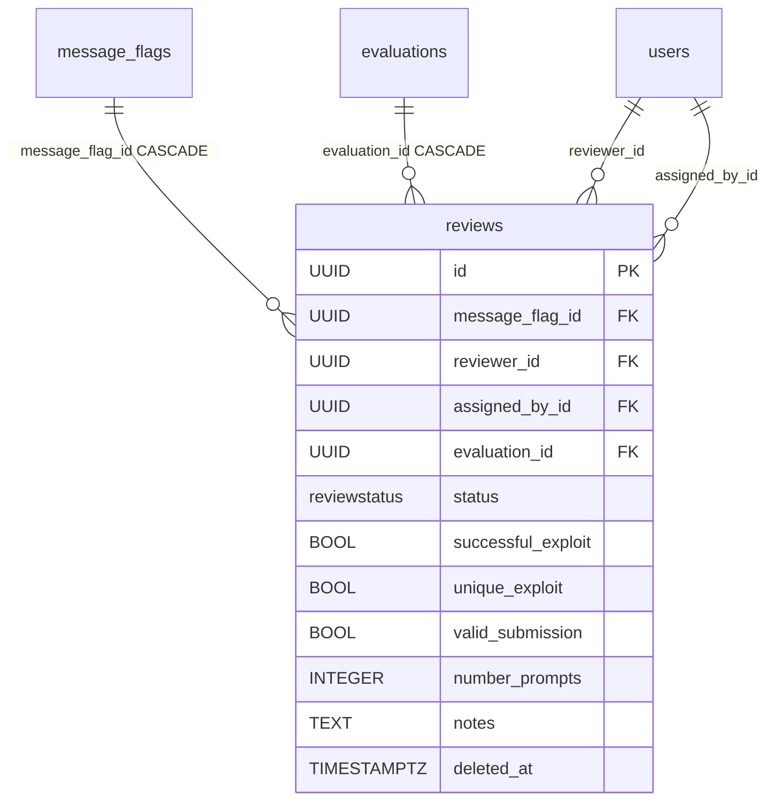

# Review

A Review is the assignment of one reviewer to a flag ([MessageFlag](message-flag.md), "submission") plus that reviewer's verdict. Creating a review is assigning a reviewer (`status` lands on `pending`), saving the verdict flips `status` to `approved`/`rejected`, and unassigning is a soft-delete. The component-level write-up is [Reviews - reviewer verdicts](../components/reviews-reviewer-verdicts.md); here is the model itself.

One table: `reviews`. The class is in `app/core/reviews/models.py`.

## reviews

Inherits `BaseModel` (`id`, `created_at`, `updated_at`, `deleted_at`).

| Column | Type | FK | ON DELETE | Note |
|---|---|---|---|---|
| `message_flag_id` | UUID | `message_flags.id` | CASCADE | the flag ("submission") under review, NOT NULL |
| `reviewer_id` | UUID | `users.id` | — | assigned reviewer, NOT NULL, indexed |
| `assigned_by_id` | UUID | `users.id` | — | who assigned (the assign caller) — audit attribution, NOT NULL |
| `evaluation_id` | UUID | `evaluations.id` | CASCADE | denormalized from the flag, NOT NULL |
| `status` | `ReviewStatus` enum | — | — | NOT NULL, default `pending`, indexed, server_default `'pending'` |
| `successful_exploit` | BOOL NULL | — | — | verdict: whether the exploit succeeded |
| `unique_exploit` | BOOL NULL | — | — | verdict: whether the exploit is unique |
| `valid_submission` | BOOL NULL | — | — | verdict: whether the submission is valid |
| `number_prompts` | INTEGER NULL | — | — | how many prompts the attempt took |
| `notes` | TEXT NULL | — | — | reviewer's free text |

The verdict fields are `null` until evaluated — assign leaves just the FKs + `status=pending`.

```python
class Review(BaseModel, table=True):
    __tablename__ = "reviews"
    __table_args__ = (
        Index(
            "ix_reviews_message_flag_id_reviewer_id",
            "message_flag_id", "reviewer_id",
            unique=True,
            postgresql_where=text("deleted_at IS NULL"),
        ),
        Index("ix_reviews_evaluation_id", "evaluation_id"),
    )

    message_flag_id: uuid.UUID = Field(foreign_key="message_flags.id", nullable=False, ondelete="CASCADE")
    reviewer_id: uuid.UUID = Field(foreign_key="users.id", nullable=False, index=True)
    assigned_by_id: uuid.UUID = Field(foreign_key="users.id", nullable=False)
    evaluation_id: uuid.UUID = Field(foreign_key="evaluations.id", nullable=False, ondelete="CASCADE")
    status: ReviewStatus = Field(default=ReviewStatus.PENDING, ...)
    successful_exploit: bool | None = Field(default=None)
    unique_exploit: bool | None = Field(default=None)
    valid_submission: bool | None = Field(default=None)
    number_prompts: int | None = Field(default=None)
    notes: str | None = Field(default=None, sa_type=Text)
```

### ReviewStatus enum

`StrEnum`, DB type `reviewstatus`, a closed set (adding a value = migration `ALTER TYPE ... ADD VALUE`):

| Value | Meaning |
|---|---|
| `pending` | initial state, reviewer assigned, no verdict |
| `approved` | reviewer's verdict |
| `rejected` | reviewer's verdict |

Separate from `FlagStatus` on [MessageFlag](message-flag.md) — the flag verdict is not (yet) derived from the review.

### Two indexes

- `ix_reviews_message_flag_id_reviewer_id` — **partial unique** `WHERE deleted_at IS NULL`: at most one **live** review per (flag, reviewer). A soft-delete frees the pair, so after an unassign you can assign the same reviewer again.
- `ix_reviews_evaluation_id` — for the review queue and the per-evaluation listing, which scope by the denormalized `evaluation_id`.

### Denormalization of `evaluation_id`

`evaluation_id` could be derived from `message_flag_id`, but it is kept directly — copied from the flag in `assign_reviewer` (under the caller's visibility). The reason is the same as for [MessageFlag](message-flag.md)/[Conversation](conversation.md): reads scope through the shared `join_visible_evaluation_group` in a single join, without walking the chain flag → conversation → evaluation.

### Lifecycle vs soft-delete

`message_flag_id` and `evaluation_id` have DB-side `CASCADE` (hard-delete). In practice soft-delete prevails: when the parent flag is soft-deleted, the review disappears from reads **via the visibility cascade** (`scope_reviews` requires a live flag), without a dedicated hook. `reviewer_id` / `assigned_by_id` are deliberately without `ondelete` — they are user attribution outside the visibility graph.

## Relationship diagram



How many reviews close a flag is set by `Scenario.required_reviews` (a queue threshold, not an assignment cap — see [Scenario](scenario.md) and [Reviews - reviewer verdicts](../components/reviews-reviewer-verdicts.md)).

## Restore

`?deleted=true` on the list carries **no permission of its own** — it returns the caller's own unassignments, or every actor's for a break-glass manager. `POST /api/v1/reviews/{review_id}/restore` revives one, with rules of its own: your own unassignment only (a manager restores anyone's), and a *decided* review additionally only by the reviewer who recorded it or that manager. A `pending` review must also still be reassignable — the assign preconditions re-checked (submission undecided, reviewer live and in the assignable pool). The verdict rides along, the reviewer is emailed as on a fresh assignment (a decided review's since-deleted reviewer is not), a tombstoned parent flag or conversation is a 404, and re-assigning that reviewer meanwhile is a 409. See [Restore - reading tombstones back](../components/restore-soft-deleted-items.md).

## Related

- [Reviews - reviewer verdicts](../components/reviews-reviewer-verdicts.md)
- [MessageFlag](message-flag.md)
- [Scenario](scenario.md)
- [Evaluation domain](../components/evaluation-domain.md)
- [RBAC - global roles](../components/rbac-global-roles.md)
- [Data model overview](data-model-overview.md)
