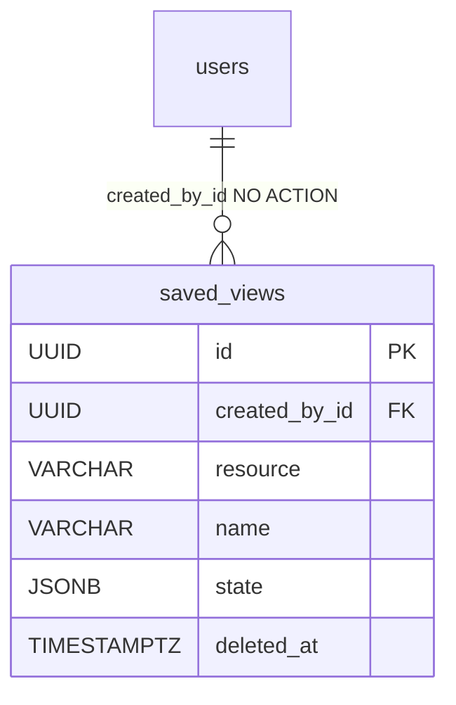

# SavedView

One user's named, reusable list-view state — the filters, sort, search, hidden columns and pagination they set on some console list, saved so they can recall it later. One table (`saved_views`) backs **every** savable list in the product; the backend is deliberately list-agnostic.

Table: `saved_views`, model: `app/core/saved_views/models.py`. Component note: [Saved views](../components/saved-views.md).

## What it is for

A red-teamer (or any user) tweaks a list — say, evaluations filtered to `published`, sorted `-created_at`, with a couple of columns hidden — and saves that arrangement under a name. Recalling it re-issues the normal list request built from the stored state. The row is personal: a saved view is of no concern to anyone but its owner, so there is no sharing and no admin cross-user access.

## Columns

Inherits `BaseModel` (`id` UUID, `created_at`, `updated_at`, `deleted_at` soft-delete). Beyond that:

| Column | Type | Notes |
|---|---|---|
| `created_by_id` | UUID NOT NULL FK → `users.id` | the owner; no `ON DELETE` (NO ACTION), indexed |
| `resource` | VARCHAR(64) NOT NULL | which list the view targets (a stable client key); a plain string, **not** a DB enum |
| `name` | VARCHAR(128) NOT NULL | the user-given view name |
| `state` | JSONB NOT NULL | the client-owned view state; `server_default '{}'` |

### Uniqueness — one name per (owner, resource), among live rows

A single partial-unique index:

```python
Index(
    "ix_saved_views_created_by_id_resource_name",
    "created_by_id",
    "resource",
    "name",
    unique=True,
    postgresql_where=text("deleted_at IS NULL"),
)
```

So a user may hold many views per list as long as the names differ; distinct users never collide; a soft-deleted name is free to reuse. It is **not** one-view-per-user, not globally named-unique. The same index also serves the owner-scoped `created_by_id [+ resource]` reads.

## `resource` — a string key, not a DB enum

The write side validates `resource` against the `SavedViewResource` StrEnum (`app/core/saved_views/enums.py`), but the DB column is plain text. Adding a savable list is a one-line enum member, no migration. The stable client-facing keys:

`evaluations`, `evaluation-groups`, `conversations`, `conversation-groups`, `message-flags`, `ai-models`, `users`, `organizations`, `reviews`, `audit-logs`.

> Removing or renaming a member is a **breaking read**: `SavedViewResponse.from_model` calls `SavedViewResource(row.resource)`, so stale rows would raise. Migrate/purge rows first. The same hazard applies to tightening the `state` envelope (it re-validates on read).

## `state` — the standardized-but-opaque envelope

The JSONB blob is validated by `SavedViewState` (`extra="forbid"`): the backend fixes the *shape*, the values are the client's. Fields: `order_by` (a `-?field` string), `filters` (an opaque `dict`), `hidden_columns` (`list[str]` of column ids), `search` (≤255), `limit` (1–100), `offset` (≥0) — mirroring the platform list query-param vocabulary. Column *visibility* is stored as hidden-column ids, not a full column order. The serialized `state` is capped at **64 KiB** on both write paths, so an authenticated caller can't persist a giant blob.

## Relationships



No FK to any target list — `resource` is a key, not a relation. `created_by_id` has no `ON DELETE`: users are soft-deleted, not physically removed.

## Restore

`?deleted=true` plus `POST /api/v1/saved-views/{view_id}/restore`, within `RESTORE_WINDOW_DAYS`. There is **no break-glass** here, so a tombstone is only ever the caller's own — and a view deleted before `deleted_by_id` existed is therefore unrestorable by anyone until it ages out of the window. Reviving a view whose `(resource, name)` a live one has since taken is a **409**. See [Restore - reading tombstones back](../components/restore-soft-deleted-items.md).

## Related

- [Saved views](../components/saved-views.md) — the service, envelope, uniqueness, and API
- [User and Role](user-and-role.md) — `created_by_id` (owner scope)
- [Pagination, bulk and soft-delete](../components/pagination-bulk-and-soft-delete.md) — the list vocabulary the `state` mirrors
- [Data model overview](data-model-overview.md) — the full ERD
