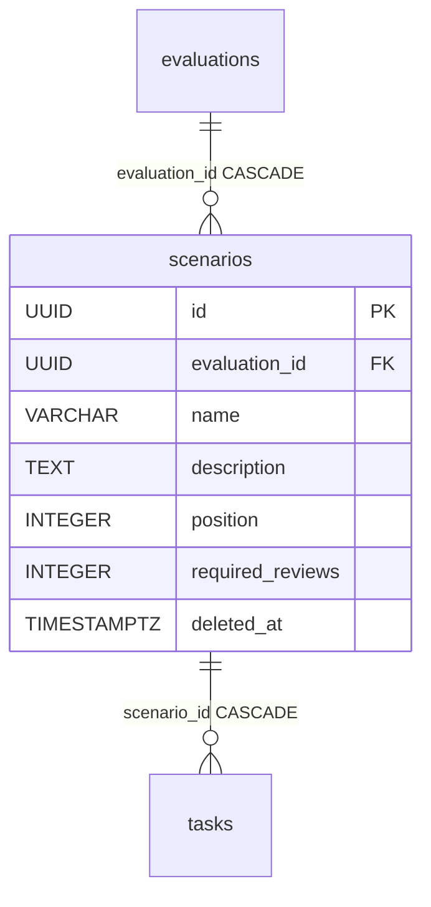

# Scenario

A Scenario is a single challenge inside an evaluation. The red-teamer gets a list of scenarios in a fixed order and tries to "break" the model on each of them. In the old (Prisma) code this model was called `Challenge` — hence the legacy name.

The hierarchy is simple: [Evaluation](evaluation.md) has many scenarios, each scenario has many [Task](task.md)s. Scenario sits in the middle.

## What it is in one sentence

A reorderable evaluation step with its own `name` and `description`, which groups concrete tasks ([Task](task.md)).

## Fields

File: `app/core/evaluations/models.py`

| Field | Type | Notes |
|---|---|---|
| `id` | UUID PK | from `BaseModel` |
| `name` | VARCHAR(255) | NOT NULL |
| `description` | TEXT | NOT NULL |
| `evaluation_id` | UUID FK | to `evaluations.id`, ON DELETE CASCADE |
| `position` | INTEGER | NOT NULL, dense numbering 0,1,2,... |
| `required_reviews` | INTEGER | NOT NULL, default 1, server_default 1, `CheckConstraint >= 1`; how many verdicts close a flag of this scenario |
| `created_at` / `updated_at` / `deleted_at` | TIMESTAMPTZ | from `BaseModel` (soft-delete) |

Plus relations: `evaluation` (parent) and `tasks` (children).

## Diagram

## The `position` field — the biggest pitfall

`position` is dense numbering: scenarios in one evaluation are numbered 0, 1, 2, 3... in sequence without gaps (after a reorder).

Two things to remember:

1. **Only the scenario service writes `position`.** The client does NOT supply a position on creation (`ScenarioCreate` has no `position` field). The service computes the next number itself.
2. **Deliberately NO unique** on `(evaluation_id, position)`. There is only a plain composite index `ix_scenarios_evaluation_id_position`. If it were unique, reorder would blow up — when rewriting many rows in one transaction, transient states have duplicate positions.

### Creating a new scenario

`create_scenario` in `app/core/evaluations/services/scenarios.py` locks the parent evaluation `FOR UPDATE` before computing the position. Reason: `position` has no DB-uniqueness, so two concurrent creates without the lock would read the same `max(position)` and collide. With the lock: it computes `max(position)` over the live rows, the new position = `0` if empty, otherwise `max + 1`.

### Reorder

`reorder_scenarios(evaluation_id, scenario_ids)`:

- Locks the whole live set of scenarios `FOR UPDATE`.
- Checks errors in order: **first an unknown id (404), then an incomplete set (409)**. `scenario_ids` must be the full set of all scenarios of the evaluation.
- Rewrites `position` = the index from `enumerate` (i.e. 0,1,2... per the order in the list).
- After the update it re-reads. This is not paranoia: the UPDATE bumps `updated_at` server-side, which expires the attribute in the session; with an async projection, without a re-read it would do a lazy-load and blow up with `MissingGreenlet`.

### Soft-delete leaves a gap

`soft_delete_scenario` only sets `deleted_at` — it does NOT re-densify the positions. After deleting one scenario in the middle, a gap remains in the numbering (e.g. 0, 1, _, 3). Only the next reorder fills the gaps.

## The `required_reviews` field — the review queue threshold

`required_reviews` says how many **completed** verdicts ([Review](review.md) in state `approved`/`rejected`) a flag of this scenario needs before the review queue stops showing it. Default 1, `CheckConstraint("required_reviews >= 1")`, set on create (`ScenarioCreate.required_reviews`, `ge=1`) and editable via PATCH. Usually odd (1 or 3) for consensus.

Pitfall: this is a **queue threshold, not an assignment limit**. `assign_reviewer` does not check this number — you can assign more reviewers than `required_reviews`. It counts only in `review_queue` (`completed_reviews < required_reviews`). When a flag does not target a live scenario, the threshold falls back to 1 (`coalesce`). Details: [Reviews - reviewer verdicts](../components/reviews-reviewer-verdicts.md).

## Relation to [Task](task.md)

One scenario has many tasks, cascading downward:

- FK `tasks.scenario_id → scenarios.id` with **ON DELETE CASCADE**.
- In practice the domain does soft-delete, not hard-delete. The DB cascade is a safety net.
- The `tasks` relation sorts via `order_by=lambda: TASK_DEFAULT_ORDER`. It's a `lambda` because `Task` is defined lower in the file than `Scenario` (the callable defers evaluation).
- `TASK_DEFAULT_ORDER = (col(Task.created_at), col(Task.id))` — one source of sorting shared by the `Scenario.tasks` embed and `list_tasks`, so the task list and the embed never diverge.

A note on loading: the `tasks` relation does **not** filter soft-deleted rows by itself. `with_tasks` in the service appends `selectinload(Scenario.tasks)` + `with_live(Task)`. See [Database and sessions](../components/database-and-sessions.md) for the soft-delete pattern.

## Visibility and authorization

A Scenario has no access control of its own — it inherits it from the parent group. Read goes through the shared backbone `join_visible_evaluation_group` (joins scenario → live evaluation → live group, plus the visibility predicate if not `can_manage`). Write goes through `authorize_scenario_mutation` with the `evaluations:update` perm — so only the `owner` role on the group passes.

The single-scenario lookup has `evaluation_id` in the key (`get_scenario`), so an id from another evaluation yields a clean 404 instead of an existence leak. Lifecycle and authorization details: [Evaluation domain](../components/evaluation-domain.md).

## Restore

`POST …/scenarios/{scenario_id}/restore` plus `?deleted=true` on both list shapes. Needs `evaluations:update`, and on the **nested** list write access to the parent group as well — the tombstone view is the restore surface, so it is authorized as a write (matching the model-assignment list); the flat list spans groups and cannot. Scoped to the caller's own deletes unless the break-glass.

The restored scenario is **appended last**, not returned to its old `position`: a reorder since may have taken that index, and with no DB unique on `(evaluation_id, position)` two live rows would then claim it. Its tasks come back with it; refused once the parent evaluation or group is deleted. See [Restore - reading tombstones back](../components/restore-soft-deleted-items.md).

## Related

- [Evaluation](evaluation.md)
- [Task](task.md)
- [Evaluation domain](../components/evaluation-domain.md)
- [EvaluationGroup](evaluation-group.md)
- [Conversation](conversation.md)
- [Review](review.md)
- [Reviews - reviewer verdicts](../components/reviews-reviewer-verdicts.md)
- [Data model overview](data-model-overview.md)
- [Database and sessions](../components/database-and-sessions.md)
- [Pagination, bulk and soft-delete](../components/pagination-bulk-and-soft-delete.md)
