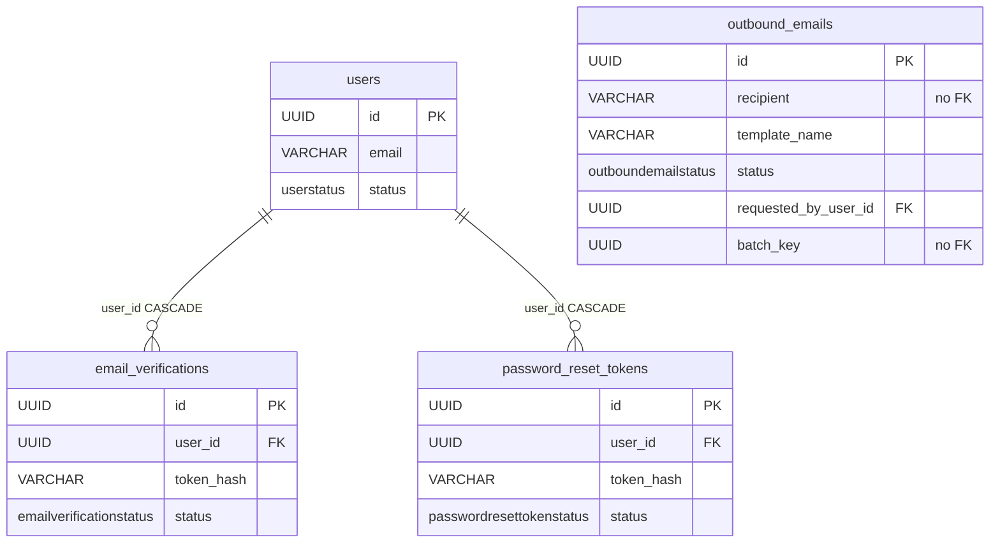

# Support tables (email, verification, reset)

These are three small tables that handle the email flow: audit of sent emails, address verification after registration, and password reset. None is "domain" — it is infrastructure around accounts and notifications. If you are looking for "where the link token landed" or "did this email even go out", it is here.

All inherit from `BaseModel` (`id` UUID, `created_at`, `updated_at`, `deleted_at`). Definitions: `app/core/auth/models.py` (verification and reset) and `app/core/email/models.py` (email audit).

## What each is for

| Table | What for | Row lifetime |
|---|---|---|
| `outbound_emails` | Audit: did the email go out, how many attempts, what error | one row per logical email |
| `email_verifications` | Address verification token after self-signup | one-time, not re-issued |
| `password_reset_tokens` | One-time password reset token | single-use link |

## outbound_emails — sending audit

One row = one logical email (not one attempt). The API side inserts with status `queued`, the Celery worker flips it to `sent` or `failed`. Task results do not sit in Celery — the entire delivery state lives here. The **recipient** link is only the `recipient` string (no FK); the only FK the table carries is `requested_by_user_id`, the human who *asked* for the mail.

Key columns:

| Column | What for |
|---|---|
| `template_name` | which template (e.g. `email_verification`), indexed |
| `recipient` | recipient address, indexed |
| `context` | JSONB, the non-secret subset of the template context. NO secrets — the link token (`accept_url`/`reset_url`/`verify_url`) travels via `secret_context` in the task signature, not here (see [Email](../components/email.md)) |
| `status` | `queued` / `sent` / `failed`, indexed |
| `requested_by_user_id` | FK -> `users.id` NULL, indexed — the human who triggered the send; drives the delivery-failure notification. NULL for system-triggered mail (self-service re-issue, verification), which notifies nobody |
| `batch_key` | UUID NULL, indexed, **no FK** — correlates the mails of one bulk request so a batch-wide failure writes one notification instead of one per row |
| `attempts` | attempt counter, incremented in the task |
| `error_type` / `error_message` | `type(exc).__name__` and `str(exc)` on error |
| `sent_at` | UTC, set on success |
| `celery_task_id` | Celery task id, for correlation in logs |
| `provider_message_id` | id on the ESP side (e.g. SES MessageId); NULL until the backend returns it |

`status` is the `OutboundEmailStatus(StrEnum)` enum. The DB stores the values (`queued`), not the enum names — `values_callable`. Details of the send and retry flow are in the [Email](../components/email.md) note.

## email_verifications — address verification

Token issued on self-signup (`User.status = PENDING`). Clicking the link activates the account. A separate table from `Invitation`, because the lifecycle is different: it is not re-issued like invitations and it has no "who invited".

The raw token NEVER reaches the DB — only `sha256(raw).hexdigest()` is stored in the `token_hash` column. The lookup goes by the hash.

Key columns:

| Column | What for |
|---|---|
| `user_id` | FK to `users`, ON DELETE CASCADE, indexed |
| `token_hash` | sha256 of the raw token; partial unique `WHERE deleted_at IS NULL` |
| `expires_at` | TTL (default 24h from `email_verification_ttl_hours`) |
| `verified_at` | successful-verification marker |
| `revoked_at` | invalidation marker (e.g. on re-registration) |
| `status` | enum `EmailVerificationStatus`: `pending` / `verified` / `expired` / `revoked` |

## password_reset_tokens — password reset

Single-use link. The same pattern as verification: the raw token only as sha256 in `token_hash`, lookup by the hash, partial unique on the hash. The difference is the `used_at` column instead of `verified_at` (one-time link — the used status goes to `used`).

Key columns:

| Column | What for |
|---|---|
| `user_id` | FK to `users`, ON DELETE CASCADE, indexed |
| `token_hash` | sha256 of the raw token; partial unique `WHERE deleted_at IS NULL` |
| `expires_at` | TTL (default 24h from `password_reset_ttl_hours`) |
| `used_at` | link-consumption marker |
| `revoked_at` | invalidation marker |
| `status` | enum `PasswordResetTokenStatus`: `pending` / `used` / `expired` / `revoked` |

The full registration, verification, and reset flow is described in [Authentication (auth)](../components/authentication.md).

## Shared token pattern

Verification and reset (as well as `invitations`) use the same machinery from `app/core/auth/services/tokens.py`:

- `generate_raw_token()` — a random `secrets.token_urlsafe` (~256 bits), returned to the user in the link.
- `hash_token(raw)` — `sha256` hexdigest, only this lands in the DB.
- `project_expired(...)` — an overdue `PENDING` is treated as `EXPIRED` without a write.

Thanks to this a database leak yields no valid links — the DB holds only the digest.

## Relationship diagram

All three hang loosely around `users` and email. `outbound_emails` ties its *recipient* by the `recipient` string alone; `requested_by_user_id` is a real FK to the requester.

## Related

- [Email](../components/email.md) — how email is sent, retries, templates, backends, delivery-failure notices
- [Authentication (auth)](../components/authentication.md) — registration, verification, and password reset flow
- [User and Role](user-and-role.md) — the `users` table these tokens refer to
- [Invitation](invitation.md) — sibling token table (the same sha256 pattern)
- [Data model overview](data-model-overview.md) — full ERD of all tables
- [Database and sessions](../components/database-and-sessions.md) — soft-delete, partial unique indexes
