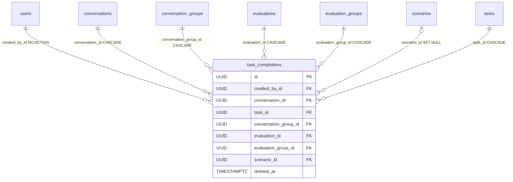

# TaskCompletion

A red-teamer's mark that one scenario [Task](task.md) is done **within a single conversation they own**. The second citizen of the `annotations` context, alongside [MessageFlag](message-flag.md). There is no "completed" column: a live row *is* the completion, un-checking soft-deletes it.

Table: `task_completions`, model: `app/core/annotations/models.py`. Component note: [Task completions](../components/task-completions.md).

## What it is for

While working a conversation against a model, a red-teamer checks off the scenario tasks they've covered. Because a [Conversation](conversation.md) has a single owner (`user_id`), a completion is per-conversation and therefore per-user by construction. The per-conversation checklist is the source of truth; a group-level "K of N conversations" roll-up reads across it.

## Columns

Inherits `BaseModel` (`id` UUID, `created_at`, `updated_at`, `deleted_at`). `created_at` **is** the check-off time (surfaced as `completed_at`); `deleted_at` un-checks. Beyond that:

| Column | Type | Notes |
|---|---|---|
| `created_by_id` | UUID NOT NULL FK → `users.id` | author; no `ON DELETE` (NO ACTION), indexed |
| `conversation_id` | UUID NOT NULL FK → `conversations.id` | the anchor; `ON DELETE CASCADE` |
| `task_id` | UUID NOT NULL FK → `tasks.id` | the task being checked off; `ON DELETE CASCADE` |
| `conversation_group_id` | UUID NOT NULL FK → `conversation_groups.id` | denormalised; `ON DELETE CASCADE`, indexed — the group roll-up scopes by it |
| `evaluation_id` | UUID NOT NULL FK → `evaluations.id` | denormalised; `ON DELETE CASCADE`, indexed |
| `evaluation_group_id` | UUID NOT NULL FK → `evaluation_groups.id` | denormalised; `ON DELETE CASCADE`, indexed |
| `scenario_id` | UUID NULL FK → `scenarios.id` | denormalised; `ON DELETE SET NULL`, indexed — nullable so a deleted scenario can't wedge the row |

The four ancestry columns (`conversation_group_id` / `evaluation_id` / `evaluation_group_id` / `scenario_id`) are resolved once at create from the conversation chain, mirroring [MessageFlag](message-flag.md). Difference from `MessageFlag`: `task_id` is **NOT NULL** here (a completion always names a task), and `TaskCompletion` **carries `conversation_group_id`** (flags don't) because the roll-up scopes by group.

### Uniqueness — one live row per (conversation, task)

```python
Index(
    "ix_task_completions_conversation_id_task_id",
    "conversation_id",
    "task_id",
    unique=True,
    postgresql_where=text("deleted_at IS NULL"),
)
```

The user is **deliberately excluded** from the index: a conversation has a single owner, so a completion is per-user by construction and the index need not carry `created_by_id`. A code comment flags what to change if conversation ownership ever becomes transferable. The partial predicate lets a soft-deleted pair be re-checked (a fresh row).

## Toggle, not status

Checking off inserts a row (idempotent — an existing live row is returned); un-checking soft-deletes it (idempotent — no live row is a no-op). Re-checking a freed pair inserts a new row with a new `created_at`. The soft-delete trail is the history.

## Relationships



## Related

- [Task completions](../components/task-completions.md) — the toggle endpoints, scoping, and roll-up
- [Task](task.md) — the checked-off task
- [Conversation](conversation.md) — the anchor (single owner ⇒ per-user)
- [MessageFlag](message-flag.md) — the sibling annotation entity
- [Data model overview](data-model-overview.md) — the full ERD
