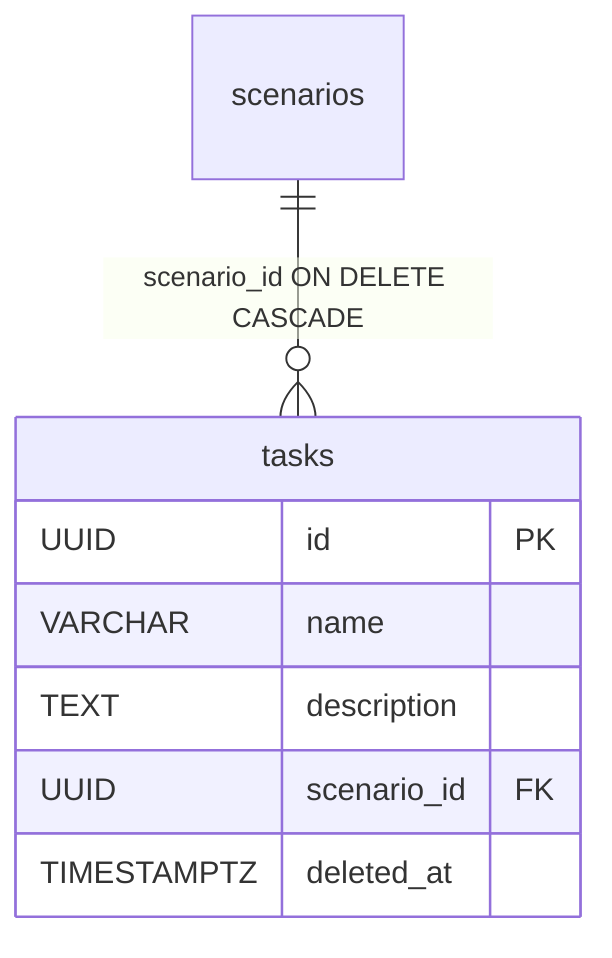
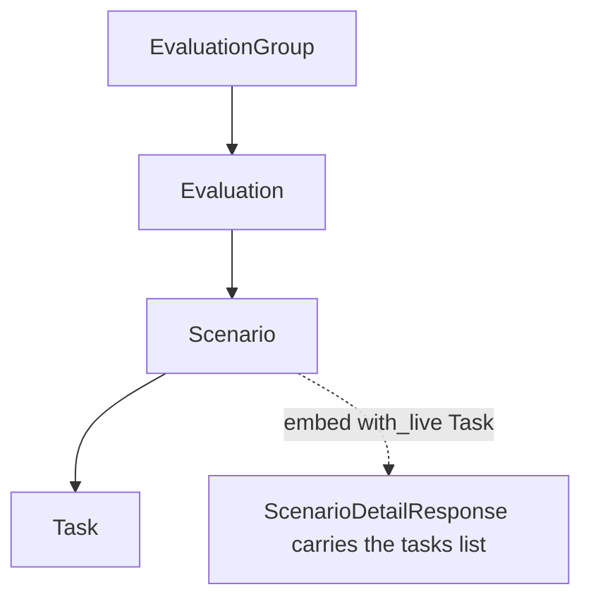

# Task

The lowest level of the evaluation hierarchy. A Task is a single task inside a scenario — it has only a name and a description, nothing more. If [Scenario](scenario.md) is a challenge ("force the model to do X"), then a Task is a concrete step or sub-task within that challenge.

The hierarchy from the top: [EvaluationGroup](evaluation-group.md) → [Evaluation](evaluation.md) → [Scenario](scenario.md) → **Task**.

## What it is for

A Task is deliberately minimal. It is not a place for logic, ordering or state — just a `name` + `description` pair attached to a scenario. The evaluation's creator breaks a scenario down into small tasks for the red-teamer.

## Data model

Table `tasks`, class `Task` in `app/core/evaluations/models.py`. Inherits from `BaseModel`, so it has `id` (UUID), `created_at`, `updated_at`, `deleted_at` (soft-delete) like every main table.

| Column | Type | Notes |
|---|---|---|
| `name` | `VARCHAR(255)` NOT NULL | task name |
| `description` | `TEXT` NOT NULL | description |
| `scenario_id` | `UUID` NOT NULL FK | parent — `scenarios.id`, ON DELETE CASCADE |

Index: `ix_tasks_scenario_id` on `(scenario_id)` — to quickly pull the tasks of one scenario.

That's all. No `position`, no status, no enums of its own.



## No ordering

Unlike [Scenario](scenario.md) (which has a `position` column and an explicit reorder), Task has **no ordering at all**. The task list sorts by `created_at`, then by `id` as a secondary key.

This is the single source of truth:

`app/core/evaluations/models.py`
```python
TASK_DEFAULT_ORDER = (col(Task.created_at), col(Task.id))
```

`TASK_DEFAULT_ORDER` is shared by two places, so that the list and the embed never diverge:

- the `Scenario.tasks` relation (`order_by=lambda: TASK_DEFAULT_ORDER` — a callable, because `Task` is defined lower in the file than `Scenario`),
- the `list_tasks` service in `app/core/evaluations/services/tasks.py`.

`id` as a secondary key gives deterministic pagination (a UUID does not change between requests).

## Deletion cascade

`scenario_id` has `ON DELETE CASCADE` at the DB level — deleting a scenario row physically deletes its tasks. The full hard-cascade chain downward: group → eval → scenario → task.

In practice the domain almost never does a hard-delete. All mutating services use **soft-delete** (`deleted_at`). Hard delete is not exposed by the API. The DB cascade is a fuse in case of a physical delete.

## No standalone list

There is no `GET /tasks`-style endpoint across the whole platform. Tasks are always addressed through the parent:

```
GET    /api/v1/scenarios/{scenario_id}/tasks
POST   /api/v1/scenarios/{scenario_id}/tasks
GET    /api/v1/scenarios/{scenario_id}/tasks/{task_id}
PATCH  /api/v1/scenarios/{scenario_id}/tasks/{task_id}
DELETE /api/v1/scenarios/{scenario_id}/tasks/{task_id}
```

Reads require `evaluations:read`, writes `evaluations:update` (via `authorize_scenario_mutation`). Routers in `app/api/v1/tasks.py`.

## Visibility and the liveness pitfall

A task's visibility goes through the shared backbone `join_visible_evaluation_group` (`app/core/evaluations/access.py`) — it joins `Task → Scenario` (live) → `Evaluation` (live) → [EvaluationGroup](evaluation-group.md) (live) and checks whether the caller sees the group. See [Evaluation domain](../components/evaluation-domain.md) and [Object roles - per-object permissions](../components/object-roles-per-object-permissions.md).

A documented pitfall in `app/core/evaluations/services/tasks.py` (`get_task`): `live_select` checks the liveness **of the task row only**, not the whole scenario/eval/group chain. Without this, a task under a soft-deleted scenario would still resolve. The mutation path relies on the earlier `authorize_scenario_mutation` (the same transaction), which enforces parent liveness.

`list_tasks` has a small optimization: it resolves the scenario via `get_scenario_by_id` **only when total == 0** — to distinguish a 404 (scenario does not exist / not visible) from a 200 with an empty list. This cuts 3 round-trips down to 2 on the typical path.

`create_task` is a plain insert — no position, no lock (unlike [Scenario](scenario.md), where create locks the parent `for_update` because of the dense `position` numbering).

## Embedding in ScenarioDetailResponse

A Task has no "rich" view of its own in the hierarchy — it shows up as a list inside the scenario detail. The `ScenarioDetailResponse` schema (in `app/core/evaluations/schemas.py`) carries `tasks: list[TaskResponse]`, and the `get_scenario(..., with_tasks=True)` service does:

```
selectinload(Scenario.tasks) + with_live(Task)
```

`with_live(Task)` is necessary here manually — ORM relations do not filter soft-deleted rows (tombstones) automatically. The embed and `list_tasks` use the same `TASK_DEFAULT_ORDER`, so the order is consistent across both projections.

The task's Pydantic schemas: `TaskResponse`, `TaskCreate`, `TaskUpdate` / `TaskUpdateChanges`.



## Restore

`POST …/tasks/{task_id}/restore` plus `?deleted=true` on the list — both need `evaluations:update` **and** write access to the parent group, and both are scoped to the caller's own deletes unless the break-glass.

The task's [TaskCompletion](task-completion.md) rows were never tombstoned, so restoring keeps every participant's checkmark where re-creating the task would lose them. Refused once the parent scenario is deleted — restore the scenario instead, which brings its tasks back. See [Restore - reading tombstones back](../components/restore-soft-deleted-items.md).

## Related

- [Scenario](scenario.md) — the task's parent, a challenge in an evaluation
- [Evaluation](evaluation.md) — one level up, the evaluation
- [EvaluationGroup](evaluation-group.md) — the top level of the hierarchy
- [Evaluation domain](../components/evaluation-domain.md) — lifecycle and visibility of the whole domain
- [Object roles - per-object permissions](../components/object-roles-per-object-permissions.md) — where write authorization comes from
- [Data model overview](data-model-overview.md) — the full ERD and relations
- [Pagination, bulk and soft-delete](../components/pagination-bulk-and-soft-delete.md) — list and soft-delete patterns
- [API - overview and conventions](../components/api-overview-and-conventions.md) — REST endpoint conventions
