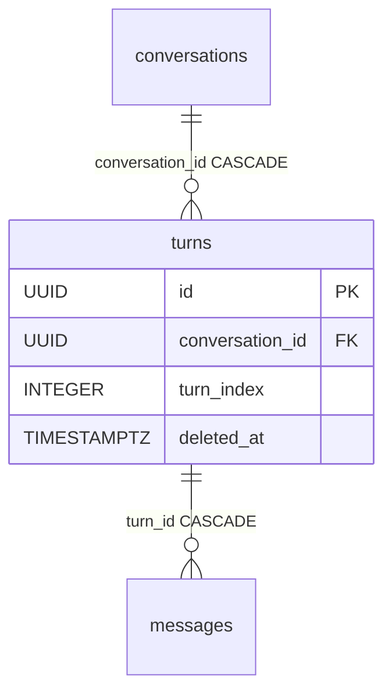

# Turn

One exchange in a conversation: a user message plus the assistant's response (or responses). [Conversation](conversation.md) is the "conversation folder" (session metadata), and the turns are its successive steps over time. A turn groups the messages of one round and gives them a place in the sequence.

Table: `turns`, class `Turn` in `app/core/conversations/models.py`. It's part of the message-persistence **write-path** — `open_turn` creates a turn under a row lock on the conversation when the client calls `POST .../messages` (see [Message persistence (write-path)](../components/message-persistence-write-path.md)).

## Data model

Inherits `BaseModel` (`id` UUID, `created_at`, `updated_at`, `deleted_at` soft-delete). Beyond that it's minimal:

| Column | Type | FK | ON DELETE | Note |
|---|---|---|---|---|
| `conversation_id` | UUID | `conversations.id` | CASCADE | parent, NOT NULL |
| `turn_index` | INTEGER | — | — | dense index 0,1,2... within a conversation |

```python
class Turn(BaseModel, table=True):
    __tablename__ = "turns"
    __table_args__ = (Index("ix_turns_conversation_id_turn_index", "conversation_id", "turn_index", unique=True),)

    conversation_id: uuid.UUID = Field(foreign_key="conversations.id", nullable=False, ondelete="CASCADE")
    turn_index: int = Field(nullable=False)
```

## turn_index: dense numbering under a lock

`turn_index` is a dense counter (0, 1, 2, ...) **local to the conversation**, not global. It's allocated as `max(turn_index) + 1` — which is why the `open_turn` service must hold a **row lock on `Conversation`** (`for_update`), otherwise two concurrent requests would get the same index. The composite unique index `(conversation_id, turn_index)` is a hard safeguard: a collision under a race ends with a `ConflictError` (409), not a silent duplicate.

## Relations by FK only

Turn **has no explicit ORM relations** (`Relationship`) or `back_populates`. The links `Conversation → Turn → Message` live solely on FKs in the database. The service loads a turn's messages with an explicit query (`live_turn_messages`), not through a navigation collection — deliberately, to control the soft-delete filter and the sort order.

## Relationship diagram



## Related

- [Message](message.md)
- [Conversation](conversation.md)
- [Message persistence (write-path)](../components/message-persistence-write-path.md)
- [Conversations](../components/conversations.md)
- [Data model overview](data-model-overview.md)
