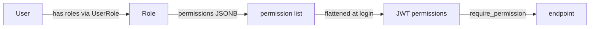
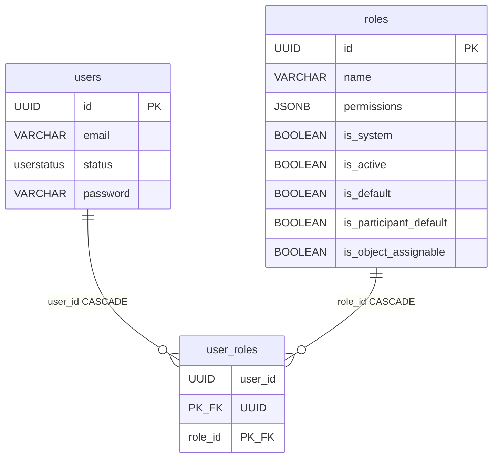

# User and Role

A user account (`User`) and its global roles (`Role`), tied together by the `UserRole` join table. This is the foundation of the whole RBAC: roles carry a list of permissions, and permissions land in the JWT and gate endpoints. This note covers the **global** permission scope — the second scope (per-object) lives in [ObjectRoleAssignment](object-role-assignment.md).

Files: `app/core/auth/models.py`.

## Why this exists

Every user has one or more global roles (`admin`, `owner`, `red_teamer`, ...). A role is a bag of permissions (strings like `users:read`). At login the permissions from all of the user's live roles are flattened and put into the JWT. Endpoints then check only the token — they no longer touch the database.



## User (table `users`)

The account. Inherits from `BaseModel`, so it has `id` (UUID), `created_at`, `updated_at`, `deleted_at` and `deleted_by_id` (soft-delete + [restore](../components/restore-soft-deleted-items.md) scoping).

| Column | Type | Notes |
|---|---|---|
| `email` | VARCHAR(320) | normalized (strip + lower); unique partial index `WHERE deleted_at IS NULL` |
| `email_verified_at` | TIMESTAMPTZ NULL | email verification marker; `None` = unverified |
| `first_name` / `last_name` | VARCHAR(255) NULL | first and last name |
| `password` | VARCHAR(255) NULL | **argon2** hash; `NULL` = passwordless account (OIDC only) |
| `password_cleared_at` | TIMESTAMPTZ NULL | stamped when an OIDC activation *wiped* an existing password — the only record of why the account is passwordless, so a self-service reset can tell "recovering a credential" from "never had one" |
| `organization_id` | UUID FK -> `organizations.id` NULL | tenancy membership; `ON DELETE SET NULL`; indexed. NULL = orgless (self-signup / legacy), platform-wide scope |
| `status` | `userstatus` | defaults to `INVITED`; indexed |

Status is the `UserStatus` enum:

| Value | Meaning |
|---|---|
| `INVITED` | default; account provisioned by an admin, awaiting invitation acceptance |
| `PENDING` | self-signup, still before email verification |
| `ACTIVE` | active account (the only status allowed to log in) |
| `INACTIVE` | deactivated (separate from soft-delete via `deleted_at`) |

The `full_name` property joins first and last name (or `None`). The `display_name` property is a human-readable label — `full_name`, and when first/last name is missing, falls back to `email` (never `None`); used in greetings and notifications (e.g. reviewer (un)assignment emails, see [Reviews - reviewer verdicts](../components/reviews-reviewer-verdicts.md)).

**Mind the three "disable" mechanisms**: soft-delete (`deleted_at`), status `INACTIVE`, and — in other tables — `disabled_at`. These are different things, easy to confuse.

The default email index is **partial** — a soft-deleted account does not block re-registering the same email.

**Tenancy.** `organization_id` is the user's membership in one [Organization](organization.md) (one user, one org). Nullable so orgless accounts stay platform-wide; `SET NULL` so deleting an org never orphans the row. The `User.organization` relationship is eager-loaded for the response embed, where a soft-deleted org projects as no organization (`OrganizationBase.from_optional_live`). See [Organizations](../components/organizations.md).

`app/core/auth/models.py`
```python
(
    Index(
        "ix_users_email",
        "email",
        unique=True,
        postgresql_where=text("deleted_at IS NULL"),
    ),
)
```

There are also GIN trigram indexes on `email`/`first_name`/`last_name` — for substring search.

## Role (table `roles`)

Definition of a global role.

| Column | Type | Notes |
|---|---|---|
| `name` | VARCHAR(64) | stable slug, machine key (e.g. `red_teamer`); unique partial index; immutable once created |
| `display_name` | VARCHAR(128) NULL | human-readable label |
| `description` | VARCHAR(255) NULL | description |
| `permissions` | JSONB | list of permission strings; `server_default '[]'` |
| `is_system` | BOOLEAN | `true` = canonical role from `sync_system_roles`, read-only downstream |
| `is_active` | BOOLEAN | default `true`; an inactive role **grants nothing** and can't be assigned, but stays in the catalog so it can be reactivated without losing assignments |
| `is_default` | BOOLEAN | default `false`; the single role auto-assigned to every new user |
| `is_participant_default` | BOOLEAN | default `false`; the single role granted on evaluation-group self-join |
| `is_object_assignable` | BOOLEAN | default `false`; whether the role may be held as an in-group (object) role |

The `label` property → `display_name or name`.

### Lifecycle flags and their DB guards

The four booleans above are enforced in the schema, not only in the service — a broken deploy state would 500 every registration or self-join:

```python
# at most one live role may be the new-user default (same shape for is_participant_default)
(Index("ix_roles_is_default", "is_default", unique=True, postgresql_where=text("is_default AND deleted_at IS NULL")),)
(CheckConstraint("NOT (is_default AND NOT is_active)", name="default_role_active"),)
(CheckConstraint("NOT (is_participant_default AND NOT is_active)", name="participant_default_role_active"),)
(
    CheckConstraint(
        "NOT (is_participant_default AND NOT is_object_assignable)", name="participant_default_role_assignable"
    ),
)
```

- Two partial-unique indexes keep **at most one live** role per default flag.
- A default must stay `is_active`: its resolver (`get_default_role` / `get_participant_default_role`) raises otherwise.
- The participant default must be `is_object_assignable`, because self-join grants it as an *object* role and resolves the flag directly instead of going through `resolve_assignable_roles`.

`is_object_assignable` is **code-owned for system roles** (`sync_system_roles` re-converges it from the object-role registry) and an operator opt-in for custom ones. The full set of service-level guards — sole-role, protected-role, non-delegable permissions — is in [RBAC - global roles](../components/rbac-global-roles.md).

### System vs custom roles

`is_system=True` rows come from `app/core/auth/roles.py`; their fields are overwritten on every deploy, so a field edit through the API is refused (400). **Custom** roles (`is_system=False`) are operator-defined through `roles:manage` and freely editable, minus the reserved slugs and the non-delegable permissions.

### permissions is a synchronized field

The `permissions` column is **not written by hand**. The dictionary of roles and permissions lives in code (`app/core/auth/roles.py`), and the `sync_system_roles` function projects it onto `roles` rows on every deploy (`make syncroles`). For system roles `permissions` is therefore derived from code — an edit in the database will be overwritten. Details of the dictionary and the mapping to JWT: [RBAC - global roles](../components/rbac-global-roles.md).

## UserRole (table `user_roles`) — the association

A pure M2M join table between `users` and `roles`.

- **Does not inherit from `BaseModel`** — it is the only table without `created_at`/`updated_at`/`deleted_at`. A plain `SQLModel`.
- Composite PK `(user_id, role_id)` — blocks duplicates (the same user won't get the same role twice).
- Both FKs have `ON DELETE CASCADE` — deleting a user or a role cleans up the join entries.



### Pitfall: the roles relationship does not filter soft-deleted

The `User.roles` relationship (loaded via `link_model=UserRole`) **does not sieve out** role tombstones. On an eager load you must manually add `with_live(Role)` to `.options(...)`, otherwise you will pull in deleted roles. That's why the JWT-minting paths do `selectinload(User.roles)` + `with_live(Role)`.

## Default role: resolved from a flag, seeded to red_teamer

Every new account (self-signup and invitation) gets the role carrying `is_default`; group self-join grants the one carrying `is_participant_default`. Both flags are **seeded onto `red_teamer`** (`DEFAULT_PARTICIPANT_ROLE` in `app/core/auth/roles.py`) when the row is first created, and an operator may reassign either through `PATCH /api/v1/roles/{id}`. The code constant is therefore the seed, not the runtime answer — resolve through `get_default_role` / `get_participant_default_role`, never by name.

Nothing constrains the participant default's *permission set*: an active, object-assignable role with no permissions resolves fine and grants nothing.

## Invitation state on the account

`User.invitations` is a viewonly relationship to **platform-scoped** invitations only (`object_type IS NULL`) — a group invite is a different lifecycle and must not surface as the account's invitation state. Ordered newest-first so the response projection reads `invitations[0]`; the `revoked_at` nulls-first tiebreak keeps the live row ahead of one just revoked (a re-invite revokes and re-issues in one transaction, where `created_at` is transaction-start time for both). `foreign_keys` is required, because `Invitation` FKs `users` twice (invitee and inviter). See [Invitation](invitation.md).

## Restore

`?deleted=true` on the user list (`users:delete`; every actor's deletes — there is no owner tier) plus `POST /api/v1/auth/users/{user_id}/restore`. A user comes back with roles, status and org membership exactly as the delete left them, behind the same elevation guard as the delete (`assert_can_restore_user` — restoring an admin needs `users:manage_admin`).

Two consequences worth knowing:

- the `provider_identities` the delete cascaded to **stay tombstoned**; the next external login re-links them, because their unique index is partial ([ProviderIdentity](provider-identity.md));
- **no session is revoked** either way, so an unexpired token minted before the delete works again.

A **role** restore is `POST /api/v1/roles/{role_id}/restore` (`roles:manage`): the permission set and activation state come back untouched, holders regain access at their next token like any grant, and a **system** role is refused (400) — `syncroles` recreates the name rather than reviving the tombstone. The deleted view must pass `include_inactive=true`, or a deactivated role's tombstone stays hidden.

## Second scope: per-object roles

Roles on `users` are **global** — they apply everywhere. Independently of them there is a second authorization scope: roles assigned to a specific object (e.g. being `owner` of one evaluation group). This lives in the `object_role_assignments` table — see [ObjectRoleAssignment](object-role-assignment.md) and [Object roles - per-object permissions](../components/object-roles-per-object-permissions.md). The bridge between scopes: a group-scoped invitation ([Invitation](invitation.md)) carries `object_type`/`object_id`, and the roles are pre-assigned on the assignment table, not on the account.

## Related

- [Authentication (auth)](../components/authentication.md)
- [RBAC - global roles](../components/rbac-global-roles.md)
- [ObjectRoleAssignment](object-role-assignment.md)
- [Object roles - per-object permissions](../components/object-roles-per-object-permissions.md)
- [Organization](organization.md)
- [Organizations](../components/organizations.md)
- [Invitation](invitation.md)
- [Support tables (email, verification, reset)](support-tables-email-verification-reset.md)
- [ProviderIdentity](provider-identity.md) — external login identities linked to a user
- [Restore - reading tombstones back](../components/restore-soft-deleted-items.md)
- [Data model overview](data-model-overview.md)
- [Flow - request authentication and authorization](../flows/flow-request-authentication-and-authorization.md)
- [Flow - evaluation group invitation](../flows/flow-evaluation-group-invitation.md)
