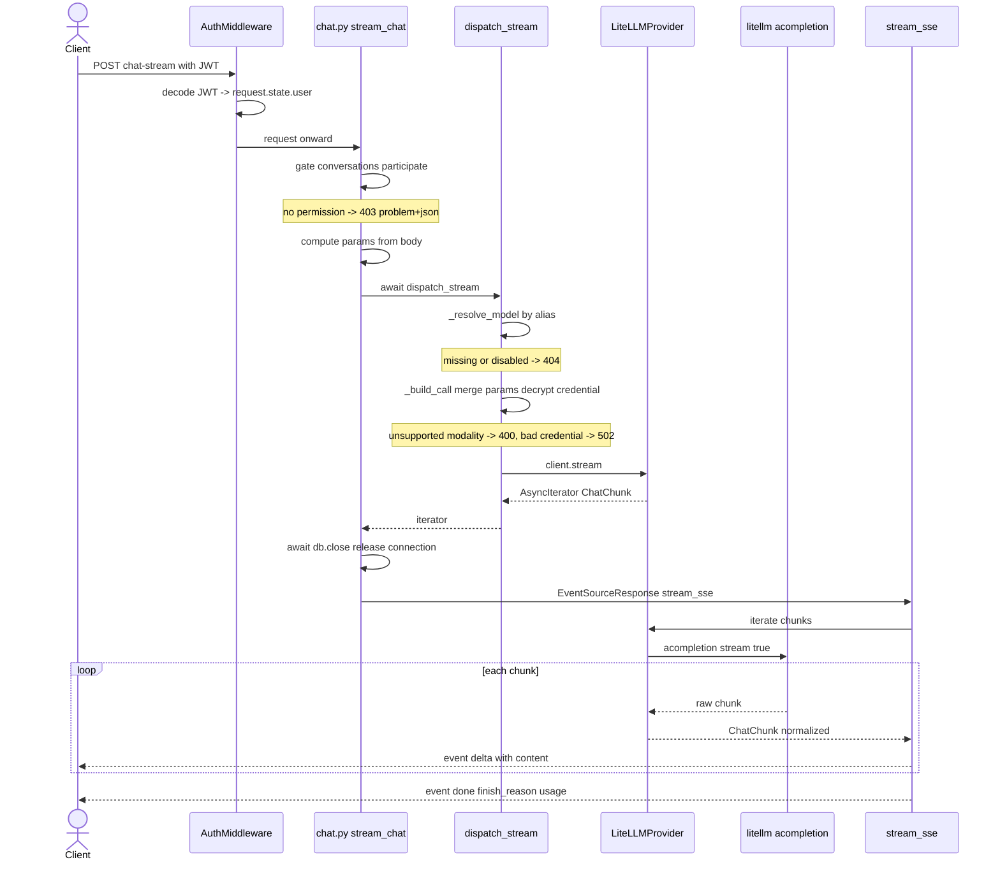

# Flow - AI message streaming (end-to-end)

This is the most important path in the system. It shows what happens to a single message from the moment the client sends `POST /api/v1/chat/stream` until the SSE event stream comes back to the browser.

Intuition in one sentence: the endpoint is **stateless** — it stores nothing in the database, it only resolves the model by alias, calls the LLM provider and translates the stream of chunks into SSE events. Second thing worth remembering: the DB session is **released before** streaming starts, so a long stream doesn't tie up a pooled connection.

If you get lost in the details of individual layers, each has its own note — I link to them along the way. Here I glue them into a single flow.

## Map of participants

| Participant | File | Role |
|---|---|---|
| Client | - | Sends POST, receives SSE events |
| Middleware | `app/core/middleware/auth.py` | Decodes JWT -> `request.state.user` |
| Endpoint | `app/api/v1/chat.py` | Gate, dispatch, DB release, SSE return |
| Dispatch | `app/core/ai_gateway/dispatch.py` | Resolves model, builds call |
| Provider | `app/core/ai_gateway/providers/litellm.py` | Adapter to the litellm library |
| SSE stream | `app/core/conversations/streaming.py` | Chunk -> delta/done/error event |

## Step by step

### 1. Client sends the request

`POST /api/v1/chat/stream` with header `Authorization: Bearer <jwt>` and a `ChatStreamRequest` body:

- `model_alias: str` — dispatch looks up the model by this alias,
- `messages: list[ChatMessage]` — at least one message; the client may pass `role="system"`, because probing the model is the core of the product,
- `params: ChatStreamParams | None` — optional inference knobs.

Body and validation details in [Endpoint POST chat-stream](../components/endpoint-post-chat-stream.md). Message shape in [AI Gateway - message types](../components/ai-gateway-message-types.md).

### 2. Middleware: auth, session, logging

The request goes through the middleware stack (ordering described in [Middleware, logging and request cycle](../components/middleware-logging-and-request-cycle.md)). `AuthMiddleware` parses the header, decodes the JWT and sets `request.state.user`. The middleware is **soft**: a bad/expired token = `user = None`, the request continues as anonymous. Enforcement is decided only by the gate on the route. Details in [Authentication (auth)](../components/authentication.md).

### 3. Gate: conversations:participate

The handler has one authorization dependency: `require_permission(Permission.CONVERSATIONS_PARTICIPATE)`. The endpoint resolves no object in the database, so this is the **only** check. No permission in the JWT -> `ForbiddenError` -> 403 problem+json. End.

Role-to-permission mapping in [RBAC - global roles](../components/rbac-global-roles.md). The `conversations:participate` permission is held by `red_teamer`, `owner` and `admin`.

### 4. Computing params

```python
params = body.params.model_dump(exclude_none=True) if body.params else None
```

`ChatStreamParams` has `extra="forbid"` (rejects unknown keys), unlike the storage-side `InferenceParams` (`extra="allow"`). The parameter cascade is described in [AI Gateway - inference parameters](../components/ai-gateway-inference-parameters.md).

### 5. dispatch_stream - resolving the model and building the call

`await dispatch_stream(db, settings, model_alias=..., messages=..., params=...)` (`app/core/ai_gateway/dispatch.py`) does, in order:

1. **`_resolve_model`** — `AiModel.live_select().where(model_alias == ...)`. No model or a model that `is_disabled` -> `NotFoundError` -> 404. Soft-deleted and disabled are treated the same: "unavailable". Model registry in [AiModel](../data-models/ai-model.md).
2. **`_build_call`**:
   - if `text` is not in `output_modalities` -> `ProviderBadRequestError`,
   - if any message carries image content parts and `image` is not in the model's `input_modalities` -> `ProviderBadRequestError` (the vision gate; a `ChatMessage.content` may be a list of text + inline-image parts — see [AI Gateway - message types](../components/ai-gateway-message-types.md)),
   - `merge_inference_params(model.parameters, params)` — request params win (call wins); a model with `advanced_params_disabled` drops the whole operator cascade here instead,
   - `system_prompt` is extracted from params and prepended as `ChatMessage(role="system", ...)`, with the gateway-owned `system_suffix` (the [conversation tag](../components/conversation-tags.md) block) appended after it — that channel exists precisely so the flag above can't suppress platform context,
   - `stop_sequences` translated to the litellm `stop` knob (without this `drop_params` would silently eat them),
   - **credential decrypt**: `resolve_api_key` -> `SecretDecryptError` caught and converted into `ProviderAuthError` (terminal, not a transient provider outage). Key encryption in [AI Gateway - key encryption](../components/ai-gateway-key-encryption.md).
3. Returns `client.stream(...)` — `AsyncIterator[ChatChunk]`, wrapped so the model's `last_used_at` is stamped on a detached session as iteration begins.

Important: `dispatch_stream` is **deliberately not an async generator**. Alias / credential / capability resolution errors surface on the `await` (before the first chunk). Provider/transport errors only on iteration. The whole dispatch in [AI Gateway - dispatch](../components/ai-gateway-dispatch.md).

### 6. Mapping pre-stream errors

The handler catches what dispatch raised on the `await`:

```python
except ProviderBadRequestError as exc:
    raise BadRequestError(str(exc)) from exc
except ProviderError as exc:
    raise BadGatewayError(str(exc)) from exc
```

`ProviderBadRequestError` -> 400, any other `ProviderError` -> 502. Both go out as `application/problem+json` **before** the stream starts (the HTTP status is not 200 yet). The full hierarchy in [AI Gateway - error taxonomy](../components/ai-gateway-error-taxonomy.md) and [Error handling (RFC 7807)](../components/error-handling-rfc-7807.md).

### 7. Releasing the DB session - a deliberate decision

```python
# Release the pooled connection before the (possibly long) stream — get_db
# would otherwise pin it for the whole response.
await db.close()
```

`dispatch_stream` finished its work with the session after its `await`. `stream_sse` never touches the DB. Without `db.close()` the `get_db` dependency would hold a pooled connection for the whole (potentially long) response — with many parallel streams the pool would be exhausted. More on sessions in [Database and sessions](../components/database-and-sessions.md).

### 8. EventSourceResponse - stream start

```python
return EventSourceResponse(stream_sse(chunks))
```

From this point the HTTP status is 200, the `text/event-stream` headers are sent. Errors can no longer go out as problem+json — they ride as an `error` body event.

### 9. stream_sse - translating chunks into events

`stream_sse(chunks)` (`app/core/conversations/streaming.py`) iterates over `AsyncIterator[ChatChunk]` and emits events with a monotonic `id` (`seq` incremented before each yield — groundwork for a future `Last-Event-ID` resume):

- takes only `chunk.choices[0]` (no support for n>1),
- non-empty `choice.delta.content` -> `event: delta`, `data: {"content": "..."}`,
- `finish_reason` and `usage` are accumulated, not sent immediately,
- after the stream is exhausted -> one terminal `event: done` with `finish_reason` + `usage`,
- a `ProviderError` during iteration -> one `event: error` (RFC 7807 shape + `retryable`); after `error` there is no `done`.

Full translation and the error-to-status mapping table in [Streaming SSE](../components/streaming-sse.md). The `ChatChunk`/`Usage` types in [AI Gateway - message types](../components/ai-gateway-message-types.md).

### 10. Client receives events

The SSE event stream: a sequence of `delta` events with text fragments, ending with `done` (or `error`). Each event has `event`, `id`, `data`.

## Sequence diagram



## Error paths

### Provider error mid-stream

The provider can fall over after sending a few `delta` events (rate limit, timeout, connection drop). litellm raises an exception, the adapter maps it to `ProviderError`, and `stream_sse` catches it and emits a single `event: error`:

```python
except ProviderError as exc:
    code, retryable = provider_error_to_status(exc)
    seq += 1
    yield _event("error", seq,
        StreamError(title=HTTPStatus(code).phrase, status=code, detail=str(exc), retryable=retryable))
```

`detail` is the **raw provider text** (it may name the real model) — that's ok for this stateless endpoint. The masked write-path (`POST .../messages`) already sanitizes it when the evaluation has `mask_models_enabled` — see [Message persistence (write-path)](../components/message-persistence-write-path.md).

### Client disconnect

When the client drops the connection, `EventSourceResponse` raises `CancelledError` inside the generator. `stream_sse` **deliberately does not catch it** — it propagates onward. But the `finally` block closes the upstream iterator:

```python
finally:
    aclose = getattr(chunks, "aclose", None)
    if aclose is not None:
        await aclose()
```

Why: `aclose()` tells the provider "stop generating" — saving tokens and connections. The `getattr` is defensive, because not every `AsyncIterator` has `aclose`.

## What this flow deliberately omits

- **No persistence** — **this** endpoint creates no row, no message history. The write-path (the [Turn](../data-models/turn.md)/[Message](../data-models/message.md) models + `persist_stream`/`open_turn`) is wired to a separate endpoint `POST .../messages` (tied to an evaluation), not to `chat.py` — see [Message persistence (write-path)](../components/message-persistence-write-path.md).
- **No `@transactional`** — the endpoint writes nothing.
- `stream_sse` is **agnostic about model/provider identity** — its structural fields carry no model name, so the module can be shared with a future masked write-path.

Persistent conversations (CRUD, owner-scoping) are a separate half of the subsystem — described in [Conversations](../components/conversations.md).

## Related

- [Endpoint POST chat-stream](../components/endpoint-post-chat-stream.md)
- [Streaming SSE](../components/streaming-sse.md)
- [AI Gateway - dispatch](../components/ai-gateway-dispatch.md)
- [AI Gateway - LiteLLM provider](../components/ai-gateway-litellm-provider.md)
- [AI Gateway - message types](../components/ai-gateway-message-types.md)
- [AI Gateway - inference parameters](../components/ai-gateway-inference-parameters.md)
- [AI Gateway - key encryption](../components/ai-gateway-key-encryption.md)
- [AI Gateway - error taxonomy](../components/ai-gateway-error-taxonomy.md)
- [Conversations](../components/conversations.md)
- [Message persistence (write-path)](../components/message-persistence-write-path.md)
- [AI Gateway - overview](../components/ai-gateway-overview.md)
- [AiModel](../data-models/ai-model.md)
- [Authentication (auth)](../components/authentication.md)
- [RBAC - global roles](../components/rbac-global-roles.md)
- [Middleware, logging and request cycle](../components/middleware-logging-and-request-cycle.md)
- [Database and sessions](../components/database-and-sessions.md)
- [Error handling (RFC 7807)](../components/error-handling-rfc-7807.md)
- [Flow - HTTP request lifecycle](flow-http-request-lifecycle.md)
- [Flow - from AI model registration to invocation](flow-ai-model-registration-to-invocation.md)
