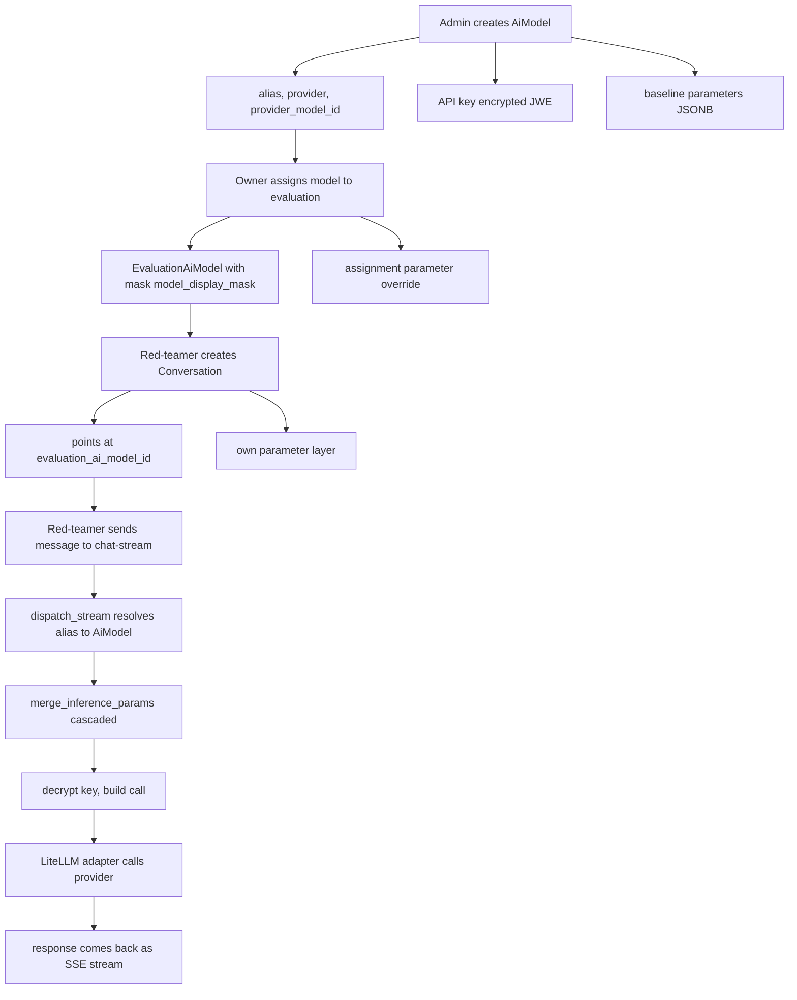
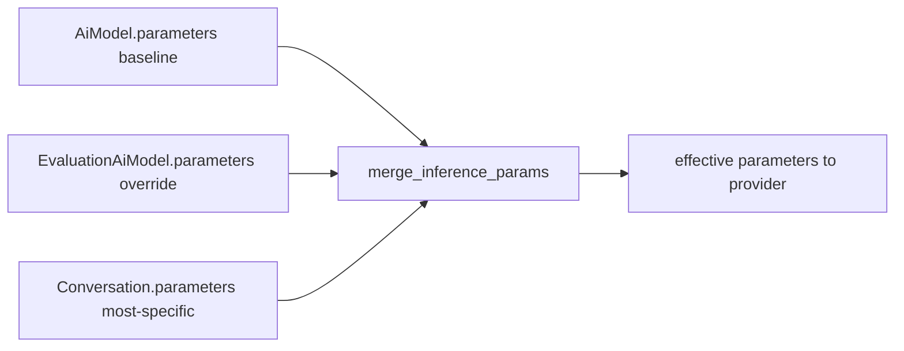

# Flow - from AI model registration to invocation

Why this exists: it shows the whole journey of an AI model in the system, from the moment an admin adds it to the registry until a red-teamer sends a message and the model replies. If you don't know "how does the system know who to talk to and with which parameters", this is the map.

In short there are three steps: **add the model** -> **assign the model to an evaluation** -> **chat**. Each step adds its own layer of parameters, and at the end dispatch merges them in a cascade and calls the provider.

## Three actors, three objects

| Step | Who does it | Object | What it adds |
|---|---|---|---|
| Registration | admin (`models:create`) | [AiModel](../data-models/ai-model.md) | alias, provider, endpoint, encrypted key, baseline parameters |
| Assignment | evaluation owner (`evaluations:update`) | [EvaluationAiModel](../data-models/evaluation-ai-model.md) | identity mask + parameter override |
| Conversation | red-teamer (`conversations:create` / `participate`) | [Conversation](../data-models/conversation.md) | most-specific parameter layer + pointer to the assignment |

Important: the conversation does NOT point at the bare model. It points at the **assignment** (`evaluation_ai_model_id`), because it inherits the mask and parameter layer from it. The bare `AiModel` is hidden behind the assignment.

## The full path



## Step 1 — admin creates AiModel

The admin does `POST /api/v1/ai-models`. The model lands in the `ai_models` table. The key fields:

- `model_alias` — a stable slug; dispatch later looks it up by this. Unique among live rows.
- `provider` — the `ProviderVendor` enum (openai, anthropic, google, azure, aws_bedrock, cohere, huggingface, generic).
- `provider_model_id` — the identifier the provider API expects.
- `inference_endpoint` — an optional custom provider URL (litellm `api_base`).
- `api_key_encrypted` — the key encrypted at-rest (JWE), never returned in a response (only `has_api_key: true` is visible).
- `parameters` — the inference parameter baseline (the lowest layer of the cascade).

Model and key details: [AiModel](../data-models/ai-model.md) and [AI Gateway - key encryption](../components/ai-gateway-key-encryption.md).

A whole fleet can be stood up at once instead of one `POST` at a time: `POST /api/v1/ai-models/bulk` registers many models in one envelope, and `POST /api/v1/ai-models/api-keys/bulk` loads their keys afterwards — each key row targeting its model by the `name` business key (unique among live rows), so no server-assigned ids need threading back from the create step. Details in [AI Gateway - overview](../components/ai-gateway-overview.md#bulk-registration-and-key-upload).

## Step 2 — owner assigns the model to an evaluation

The owner does `POST /api/v1/evaluations/{id}/models`. An [EvaluationAiModel](../data-models/evaluation-ai-model.md) is created — a join row linking the model to the evaluation. It adds two things:

- `model_display_mask` — an alias substituted for the real identity when the evaluation masks models (`mask_models_enabled=True`). The red-teamer sees the mask, doesn't know what it's talking to.
- `parameters` — an override of parameters over the model baseline (the middle layer of the cascade).

One live assignment per `(model, evaluation)` pair — enforced by a partial-unique index.

## Step 3 — red-teamer creates a Conversation and chats

The red-teamer does `POST /api/v1/evaluations/{id}/conversations` pointing at `evaluation_ai_model_id`. The [Conversation](../data-models/conversation.md) carries:

- a link to the assignment (through it, it inherits the mask and parameters),
- its own `parameters` — the **most-specific layer of the cascade**.

The conversation starts empty. A conversation with history persistence is run by the write-path `POST .../conversations/{cid}/messages` ([Message persistence (write-path)](../components/message-persistence-write-path.md)); the stateless `POST /api/v1/chat/stream` is a separate track without persistence — details in [Flow - AI message streaming (end-to-end)](flow-ai-message-streaming-end-to-end.md).

### Optional: warm up first (scale-to-zero models)

If the assigned model has `warmup_enabled` set — a self-hosted SLM or serverless GPU endpoint that scales to zero — the client should warm it before the first message: `POST /api/v1/evaluations/{id}/models/{assignment_id}/warmup` fires a throwaway 1-token probe (which itself triggers the wake) and returns a coarse `WarmupStatus` (`ready` / `starting` / `error`). Poll until `ready`, then send. This rides `dispatch_probe`, not `dispatch_stream` — see [AI Gateway - dispatch](../components/ai-gateway-dispatch.md#warmup-probe-dispatch_probe).

## What dispatch does on invocation

When a message reaches the gateway, `dispatch_stream` (or `dispatch_chat`) does, in order:

1. **Resolves the alias** — `AiModel.live_select()` by `model_alias`; soft-deleted or disabled = `NotFoundError`.
2. **Merges parameters in a cascade** — `merge_inference_params(...)`, most-specific wins.
3. **Translates knobs** — `system_prompt` extracted and prepended as a system message, `stop_sequences` -> `stop`.
4. **Decrypts the key** — `resolve_api_key`; an unreadable credential -> `ProviderUnavailableError`.
5. **Calls the adapter** — `LiteLLMProvider` maps the vendor to a prefix and fires at `litellm.acompletion`.

The mechanics of alias resolution and call building: [AI Gateway - dispatch](../components/ai-gateway-dispatch.md).

`app/core/ai_gateway/dispatch.py`
```python
model = await _resolve_model(session, model_alias)
client = provider or _DEFAULT_PROVIDER
return await client.chat(**_build_call(model, settings, messages, params), timeout=timeout)
```

## Parameter cascade — three layers

This is the core of the whole flow. The same knobs (temperature, top_p, max_tokens...) can hang at three levels. Dispatch merges them so that the closest one wins:



The effective-parameters formula:

`merge_inference_params(ai_model.parameters, assignment.parameters, conversation.parameters)`

A two-state rule: a present key overrides, an absent key inherits from a higher layer. There is no "clear" state — the write path strips `null` knobs. Full explanation: [AI Gateway - inference parameters](../components/ai-gateway-inference-parameters.md).

## Example

1. Admin registers `gpt-4o-internal` with `parameters={"temperature": 0.7}`.
2. Owner assigns it to the "Phishing probe" evaluation with mask `Model-A` and `parameters={"temperature": 0.2}`.
3. Red-teamer creates a conversation on that assignment with `parameters={"max_tokens": 500}`.
4. Dispatch merges: `{"temperature": 0.2, "max_tokens": 500}` (the assignment overrode the baseline, the conversation added its own).
5. The provider gets these parameters; the red-teamer still sees only `Model-A`.

## Related

- [AiModel](../data-models/ai-model.md)
- [EvaluationAiModel](../data-models/evaluation-ai-model.md)
- [Conversation](../data-models/conversation.md)
- [AI Gateway - dispatch](../components/ai-gateway-dispatch.md)
- [AI Gateway - inference parameters](../components/ai-gateway-inference-parameters.md)
- [Flow - AI message streaming (end-to-end)](flow-ai-message-streaming-end-to-end.md)
- [AI Gateway - key encryption](../components/ai-gateway-key-encryption.md)
- [AI Gateway - overview](../components/ai-gateway-overview.md)
