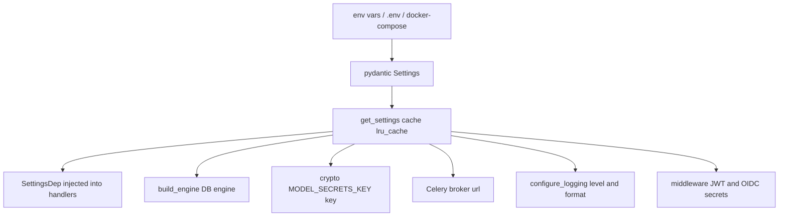

# Flow - config from env to Settings

All process configuration flows from a single source: environment variables. They land in the `Settings` object, which is read once and cached, and then injected everywhere something is needed. Nobody reads env "on the side" — it is the same instance for the whole process.

## Why this

To have **one source of truth** for the config. Want to know where the DB password or the encryption key came from? You look at `Settings`. Want to add a new option? You add a field to `Settings` and an env variable. No global `os.environ.get(...)` scattered across the code.

## The path in one diagram



## Step by step

### 1. Source — env, `.env`, Compose

Values can come from three places. The resolution order (pydantic-settings, from highest priority):

| Priority | Source | Note |
|---|---|---|
| 1 | process environment variables | e.g. injected by Compose or deploy |
| 2 | `.env` file | local dev, a copy of `.env.example` |
| 3 | default in the `Settings` field | when nobody set it |

In Compose env enters the container, in local dev `.env` is read. Field names map 1:1 to uppercase variables: the `database_host` field takes `DATABASE_HOST`. Details of the variable list in [Configuration (Settings)](../components/configuration-settings.md).

### 2. `Settings` — validation at startup

`app/core/config.py`

```python
model_config = SettingsConfigDict(env_file=".env", extra="ignore")
```

`extra="ignore"` — unknown env variables are ignored (the same `.env` is sometimes shared with sibling services). Fields without a default (e.g. `environment`, `database_host`, `session_jwt_secret`) are required — their absence is a validation error **at process startup**, not later at runtime. Secrets (e.g. `model_secrets_key`) have `min_length=32`, so too short a key also fails the boot.

### 3. `get_settings()` — read once per process

`app/core/config.py`

```python
@lru_cache
def get_settings() -> Settings:
    return Settings()
```

`lru_cache` makes env and `.env` read **once**. Every subsequent `get_settings()` returns the same instance. Tests do not mutate the instance — they call `get_settings.cache_clear()` or override the FastAPI dependency.

### 4. Consumers — who takes the config and how

`SettingsDep` is the DI alias injected into handlers. The rest of the subsystems take `Settings` at their startup point (lifespan, engine factory, Celery configuration).

`app/core/dependencies.py`

```python
SettingsDep = Annotated[Settings, Depends(get_settings)]
```

| Consumer | What it takes from Settings | What for |
|---|---|---|
| API handlers | via `SettingsDep` | access to any option in the request |
| `build_engine` | `database_url`, pool parameters | async DB engine — see [Database and sessions](../components/database-and-sessions.md) |
| crypto | `MODEL_SECRETS_KEY` (+ retired) | encrypting model API keys at-rest — see [AI Gateway - key encryption](../components/ai-gateway-key-encryption.md) |
| Celery | `broker_url` | background task broker |
| logging | `log_level`, `log_format` | structlog configuration |
| middleware | JWT secret, OIDC session secret | token decoding, OIDC cookie |
| bulk | `bulk_max_rows` | hard row limit of the bulk endpoint |
| conversations | `max_conversation_group_size` | hard cap on conversations per group (batch-create, add, move) — see [Conversation groups](../components/conversation-groups.md) |

## Computed URL — ready-made connection strings

`Settings` computes addresses from individual fields, so the consumer does not assemble them by hand:

| Property | Returns | For whom |
|---|---|---|
| `database_url` | `postgresql+asyncpg://...` | FastAPI (async) |
| `database_url_sync` | `postgresql+psycopg://...` | Celery workers (sync) |
| `redis_url` | `redis://host:port/0` | app cache |
| `broker_url` | `celery_broker_url` or fallback to `/1` | Celery broker |

## One-way rule

Config flows **in one direction**: env → `Settings` → `get_settings()` → consumers. Nowhere else does anything reach for `os.environ`. Consequences:

- Want to know what the system loaded? You read `Settings`, you do not search for `getenv` across the repo.
- A bad config fails **at startup** (Pydantic validation), not at some random moment later.
- The keyring validator checks key-id collisions for `MODEL_SECRETS_KEY` and `MODEL_SECRETS_KEY_RETIRED` also at boot — not as a runtime decrypt failure.
- A second cross-field validator rejects a session config where `refresh_absolute_max_lifetime_seconds` is not strictly greater than `refresh_token_ttl_seconds` — also at boot, so a misconfig can't silently disable sliding-window token rotation.
- `_validate_email_backend` rejects an incoherent mail config (`EMAIL_BACKEND=smtp` with no `SMTP_HOST`, or a `SMTP_USERNAME` with no `SMTP_PASSWORD`) — otherwise it would surface only when the Celery worker sends the first mail.
- `_validate_export_storage` rejects `EXPORT_STORAGE_BACKEND=s3` with no `EXPORT_S3_BUCKET` — otherwise every export job would land `failed` until noticed.
- `_validate_default_data_license` rejects a `PLATFORM_DEFAULT_DATA_LICENSE` that is not a curated SPDX id (the code-shipped seed set in `licenses/catalog.py`).

The stack and versions of the tools at play here (pydantic-settings, uv, Compose) are described in [Stack and tooling](../basics/stack-and-tooling.md).

## Related

- [Configuration (Settings)](../components/configuration-settings.md)
- [Database and sessions](../components/database-and-sessions.md)
- [AI Gateway - key encryption](../components/ai-gateway-key-encryption.md)
- [Stack and tooling](../basics/stack-and-tooling.md)
