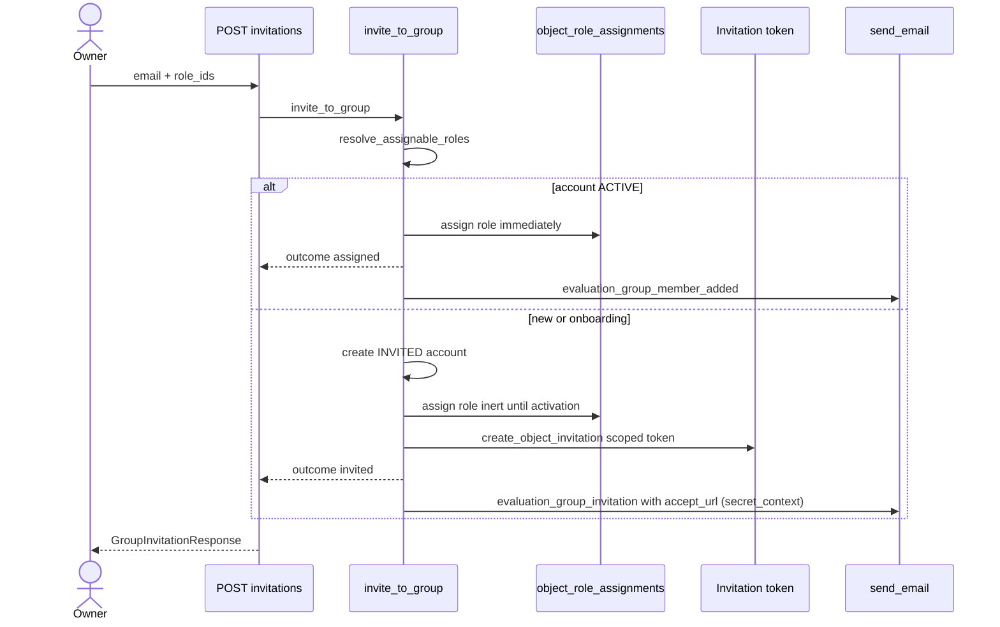

# Flow - evaluation group invitation

How you add someone to an evaluation group by e-mail. You enter an address and roles, and the system either assigns the roles right away (if the account already exists and is active), or creates an invitation account and sends an activation link. In both cases the roles on the group are granted IMMEDIATELY, so the invitee shows up in the member list at once.

The endpoints live in `app/api/v1/evaluation_group_invitations.py`, the logic in `app/core/evaluations/services/group_invitations.py`.

## Why this exists

A group owner (or admin) wants to pull red-teamers/annotators into their engagement. Two worlds:

- The address already has an **active** account on the platform -> we just add the roles on the group to it. This is `outcome="assigned"`.
- The address is new or it's onboarding -> we create an account with status `INVITED`, generate a scoped token and send a link. This is `outcome="invited"`.

Roles are not an attribute of the invitation. They live on the `object_role_assignments` table (see [Object roles - per-object permissions](../components/object-roles-per-object-permissions.md)). The [Invitation](../data-models/invitation.md) carries only the scope `(object_type, object_id)` + token.

## Endpoints

One endpoint — `POST /api/v1/evaluation-groups/{group_id}/invitations/bulk`, gated by `ManageMembersDep` (= the `evaluation_groups:manage_members` permission, held by the in-group `owner`).

| Method | Path | Transaction | Mail send |
|---|---|---|---|
| POST | `/bulk` | no `@transactional` (`apply_bulk` has its own boundary) | best-effort after commit |

**Bulk is the only invite path**, so a single invitee is a one-row request: visibility and permission are checked once at the envelope level, and per-row outcomes land in `results[].error`. The body is `GroupInvitationBulkRequest(BulkRequest[GroupInvitationCreate])` — each row an `email: NormalizedEmail` + `role_ids` (min 1) — with a `_validate_unique_emails` validator (a duplicate address in the batch -> 422) and the same `MAX_INVITE_ROWS` (100) cap as the platform envelope. The two deliberately share the cap and the duplicate rule: they feed one operator action, so a limit that differed would surface as the same dialog accepting a CSV here and rejecting it there.

Response: `GroupInvitationResponse` with the field `outcome: Literal["assigned","invited"]`.

## What `invite_to_group` does

Signature: `invite_to_group(*, group, inviter, email, role_ids)`. Steps:

1. `resolve_assignable_roles` — maps `role_ids` to live roles, rejects unknown / not-assignable ones on this object type (`BadRequestError` 400). Assignable for a group: `{owner, red_teamer, annotator, viewer}`.
2. User lookup by address.
   - status `INACTIVE` -> `ConflictError` 409 (account deactivated, we don't invite).
   - status `ACTIVE` -> `_assign_roles` immediately, `outcome="assigned"`, mail `evaluation_group_member_added`.
   - new / onboarding -> `_create_invited_user` (status `INVITED`, default global role `red_teamer`), `_assign_roles`, `create_object_invitation` (token scoped to the group), `outcome="invited"`, mail `evaluation_group_invitation` with `accept_url` in `secret_context` (the URL with the token doesn't land in `OutboundEmail.context` — see [Email](../components/email.md)).

### `_assign_roles` — roles granted right away

In both branches (active and new) the roles land on the group immediately. `object_role_assignments` is the source of truth for visibility and authority, so the invitee shows up in the member list before activating the account.

- if the user already holds some roles on the group (`held_roles` non-empty) -> `set_member_roles` (reconciliation of the whole set, a re-invite swaps the roles).
- otherwise -> `add_member`.

For onboarding the roles are **inert until activation** — the rows exist, but the account has no password yet and no `ACTIVE` status, so the user can't do anything with them until they click the link.

## Sequence diagram

## Mail send — single vs bulk

The difference matters, because it concerns token consistency.

- **Single** — the `evaluation_group_invitation` mail goes in the same transaction (the route is `@transactional`). If the send fails, the rollback also reverts the token — no orphaned link is left behind. This is the `send_email` variant (a precondition of the operation). The `accept_url` (the only escape route for the raw token — it never reaches the DB) rides in `GroupEmailSpec.secret_context`, so the spec must be either sent or dropped within the same request. The `assigned` mail is best-effort.
- **Bulk** — `apply_bulk` holds its own transaction boundary; the mails go out **best-effort after commit**. Known limitation: the Celery enqueue can outrun the commit of the `OutboundEmail` audit row -> the task sees a missing row and drops it as `email.task.row_missing`. That's why after dispatch there is an extra `await db.commit()` for the audit rows.

Mail mechanics details (render up-front, the `outbound_emails` table, retry) in [Email](../components/email.md).

## What you see afterwards

The invitee is in the group member list right away (`GET /api/v1/evaluation-groups/{group_id}/members`), because the list reads `object_role_assignments`, not the invitation status. For `invited` the user is there even before account activation — they have roles, but can't log in until they click the `accept_url`.

Accepting the invitation (setting a password, `status=ACTIVE`) goes through the shared auth flow `accept_invitation` — the object-scoped roles are already assigned, so nothing is granted there. See [Evaluation domain](../components/evaluation-domain.md) and [Authentication (auth)](../components/authentication.md).

## Pitfalls

- **Roles are not an invitation field.** The token carries only the group scope; roles live on `object_role_assignments`. A re-invite with a different set of roles swaps the whole set via `set_member_roles`.
- **`assigned` does not send a scoped token** — the active user already has an account, they only get a `evaluation_group_member_added` notification mail.
- **Bulk silently loses mails** in the enqueue-vs-commit race (dropped as `email.task.row_missing`) — this is a known limitation, not a data bug (the roles are granted anyway).
- **`INACTIVE` -> 409**, not reactivation. We don't resurrect a deactivated account via an invitation.

## Related

- [Invitation](../data-models/invitation.md)
- [Object roles - per-object permissions](../components/object-roles-per-object-permissions.md)
- [Evaluation domain](../components/evaluation-domain.md)
- [Email](../components/email.md)
- [EvaluationGroup](../data-models/evaluation-group.md)
- [Authentication (auth)](../components/authentication.md)
- [Flow - request authentication and authorization](flow-request-authentication-and-authorization.md)
