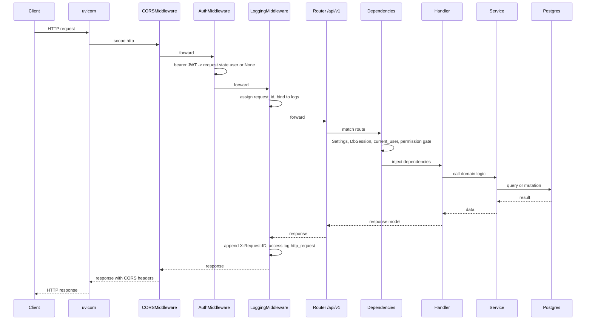
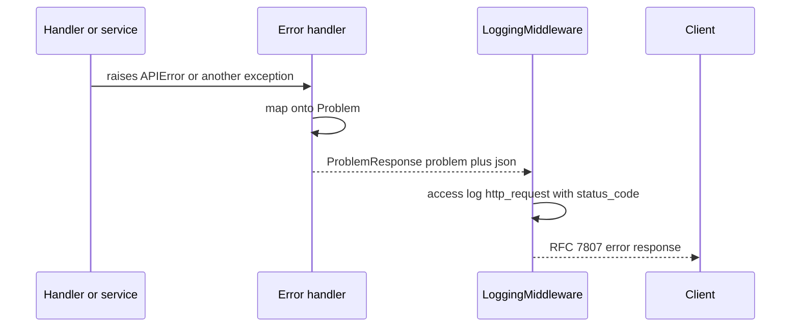

# Flow - HTTP request lifecycle

What happens to a request from the moment the client sends it to the moment it gets a response. This is the "frame" around every endpoint: the same layers fire for login, listing models, or streaming. Once you understand this cycle, you know where to look when something breaks.

Think of it like an onion: the request enters through successive middleware layers, reaches the handler in the center, and the response exits back out the same way. If an exception flies along the way, the global error handler catches it and returns an RFC 7807 envelope.

## Layers in order

The application process is a single FastAPI (`app.main:app`) served by uvicorn. The request passes through the middleware stack, the `/api/v1` router, dependencies, handler, and service.

| Layer | File | What it does |
|---|---|---|
| uvicorn | — | ASGI server, hands the request to FastAPI |
| CORSMiddleware | `app/main.py` | preflight and CORS headers, outermost layer |
| AuthMiddleware | `app/core/middleware/auth.py` | decodes the bearer JWT into `request.state.user` or `None` |
| LoggingMiddleware | `app/core/middleware/logging.py` | assigns `request_id`, the `X-Request-ID` header, the `http_request` access log |
| ScopedSessionMiddleware | `app/core/middleware/scoped_session.py` | OIDC session cookie, only on `/api/v1/auth/oidc` |
| router `/api/v1` | `app/api/v1/__init__.py` | routes to the domain handler |
| dependencies | `app/core/dependencies.py` | injects Settings, DbSession, current user, pagination, permission gate |
| handler | `app/api/v1/<resource>.py` | HTTP layer, validation, transaction boundary |
| service | `app/core/<context>/services/*.py` | domain logic, authorization, queries |
| DB | `app/core/database.py` | one async session per request |

### Middleware order - important

`add_middleware` adds layers from the inside out. So the execution order on the request is the REVERSE of the order in the code. In `app/main.py` they are added in the order: ScopedSession, Logging, Auth, CORS - so on the request they execute from CORS (outermost) to ScopedSession (innermost). CORS is last in the code on purpose, so it answers preflight before anything else moves and so it wraps every response. Details in [Middleware, logging and request cycle](../components/middleware-logging-and-request-cycle.md).

## Sequence diagram



## Error path

When an exception flies anywhere in the handler or service, the request does not finish normally. It is caught by one of the global handlers registered by `register_error_handlers(app)` in `app/main.py`. Each of them returns a `ProblemResponse` with media type `application/problem+json` - the RFC 7807 envelope.



Four handlers, each for a different exception family:

| Exception | Status | What it returns |
|---|---|---|
| `APIError` and subclasses | per class (400-502) | Problem with `instance` equal to the path; on 401 it adds `WWW-Authenticate: Bearer` |
| `RequestValidationError` | 422 | Problem with an `errors[]` list |
| `StarletteHTTPException` | per exception | renders the raw HTTPException, preserves the original headers |
| `Exception` (catch-all) | 500 | logs the traceback, but the body never leaks internal details |

Routers raise classes from the `APIError` hierarchy (`app/core/exceptions.py`), not `fastapi.HTTPException`. The full error map is in [Error handling (RFC 7807)](../components/error-handling-rfc-7807.md).

## Transaction boundary

An important pitfall: `get_db` gives one session per request, but does NOT manage the transaction boundary. A mutating handler (POST/PATCH/DELETE) must be wrapped with the `@transactional` decorator from `app/core/database.py`, otherwise INSERTs are lost when the session closes.

`app/core/database.py`

```python
async def get_db() -> AsyncIterator[AsyncSession]:
    if _session_factory is None:
        raise RuntimeError("Database not initialised ...")
    async with _session_factory() as session:
        yield session
```

`@transactional` commits on success and rolls back on an exception. Exception: bulk handlers do NOT use `@transactional`, because bulk manages the transaction itself. More on sessions and soft-delete in [Database and sessions](../components/database-and-sessions.md).

## What every request carries in the logs

`LoggingMiddleware` assigns a fresh `request_id` (uuid4 hex) and binds it to structlog `request_id`, `method`, `path`. Every log during that request carries these fields. At the end, in the `finally` block, one access log fires - the `http_request` event with `status_code` and `duration_ms`. The default `status_code` is 500, so even if the inner app raises before responding, the access log fires anyway. The inbound `X-Request-ID` is ignored on purpose (attacker-controlled until there is a trusted edge proxy).

## Authentication in short

`AuthMiddleware` only decodes the bearer JWT and puts a `SessionUser` into `request.state.user` (or `None`, when the token is missing or bad). It does not block on its own - the request flies on as anonymous. The "can this user" decision is made later, in the dependencies on a specific route (the permission gate). The full flow in [Flow - request authentication and authorization](flow-request-authentication-and-authorization.md).

## Related

- [Middleware, logging and request cycle](../components/middleware-logging-and-request-cycle.md)
- [Error handling (RFC 7807)](../components/error-handling-rfc-7807.md)
- [Database and sessions](../components/database-and-sessions.md)
- [Flow - request authentication and authorization](flow-request-authentication-and-authorization.md)
- [Architecture overview](../basics/architecture-overview.md)
- [API - overview and conventions](../components/api-overview-and-conventions.md)
- [Flow - AI message streaming (end-to-end)](flow-ai-message-streaming-end-to-end.md)
