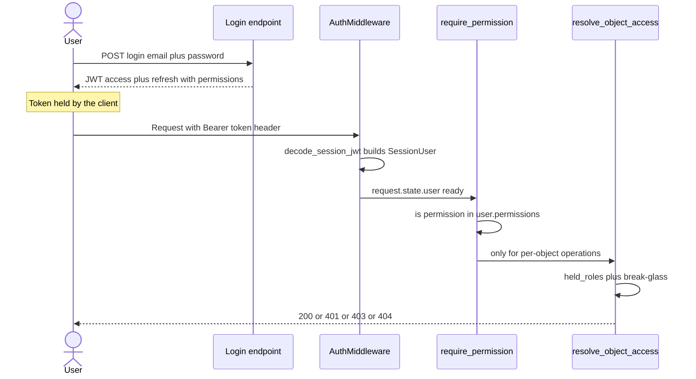
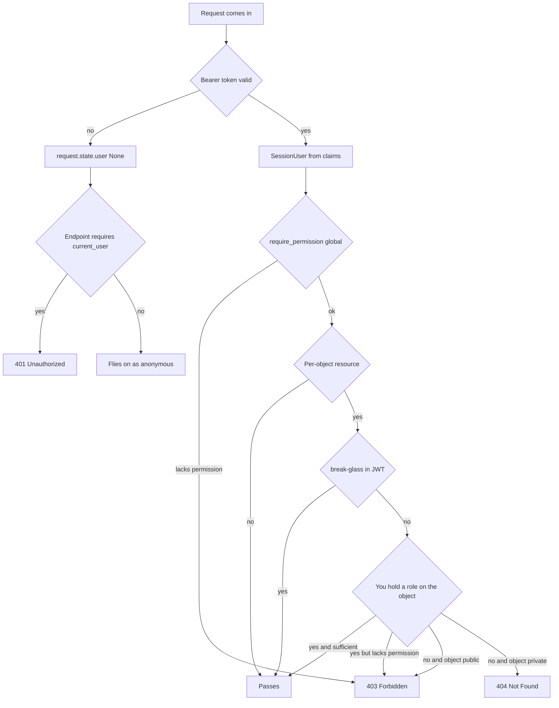

# Flow - request authentication and authorization

For every request the system answers two questions: **who you are** (authentication / auth) and **what you can do** (authorization / authz). It knows the identity from the JWT token you got at login; it checks permissions in two scopes: global (from the token) and per-object (from the database). This note assembles these pieces into one path.

## Short version for the impatient

1. You log in → you get a JWT, which inside carries the list of your permissions (`permissions`).
2. Every subsequent request carries this token in the `Authorization: Bearer ...` header.
3. The middleware reads the token and puts your identity into `request.state.user`.
4. The endpoint, via `require_permission`, checks whether you have the global permission.
5. For an operation on a specific object (e.g. an evaluation group) a second per-object check kicks in (`resolve_object_access`).
6. Result: it passes, or `401` / `403` / `404`.

## Two authorization scopes

This is the key distinction. Don't confuse them.

| Scope | Where permissions come from | Checked by | Example |
|---|---|---|---|
| Global (platform) | from the JWT, the `permissions` field | `require_permission` | `users:read`, `models:create` |
| Per-object | from the database, the `object_role_assignments` table | `resolve_object_access` | access to a specific evaluation group |

Global says "are you even allowed to touch users / models at all". Per-object says "are you allowed to touch *this specific* group". Details: [RBAC - global roles](../components/rbac-global-roles.md) and [Object roles - per-object permissions](../components/object-roles-per-object-permissions.md).

## Sequence: from login to response



## Step 1 - login issues the JWT

Email+password login calls `authenticate_credentials`, and on success `mint_token_pair`, which mints a token pair. A *flattened* set of permissions from the user's **live** roles lands in the token.

`app/core/auth/services/jwt.py`

```python
now = int(time.time())
claims: dict[str, Any] = {
    **_identity_claims(user, provider=provider),
    "typ": _TYP_ACCESS,
    "iat": now,
    "exp": now + ttl_seconds,
}
token = jwt.encode({"alg": algorithm}, claims, _key(secret), algorithms=[algorithm])
return token, ttl_seconds
```

An important pitfall: `_flatten_permissions` returns `[]` if the roles are not eager-loaded beforehand — that's why every token-minting path must load the roles first. A second consequence: **permissions are frozen for the lifetime of the token** (access TTL ~24h). No immediate revocation — this is a deliberate decision. The only way to pick up new permissions before the access token expires is `POST /auth/refresh`, which re-reads the live user from the DB and re-mints the pair (rotating the refresh token, capped by an absolute `auth_time` ceiling). More on login, refresh, OIDC and resets: [Authentication (auth)](../components/authentication.md).

## Step 2 - middleware reads the identity

`AuthMiddleware` is "soft": an invalid, expired, or missing token does not break the request — it sets `request.state.user = None` and the request flies on as anonymous. Enforcement is decided only by the route dependencies. The middleware **never reads the database** — it takes the whole identity from the token claims. Its one external lookup is the **force-logout marker in Redis**: a token minted at or before an admin's revocation is dropped to anonymous (fail-open on a Redis error). See [Authentication (auth)](../components/authentication.md).

`app/core/middleware/auth.py`

```python
request.state.user = None
header = request.headers.get("authorization", "")
scheme, _, token = header.partition(" ")
if scheme.lower() == "bearer" and token:
    settings = get_settings()
    try:
        user = decode_session_jwt(token, secret=..., algorithm=...)
    except InvalidSessionTokenError:
        user = None
    if user is not None and await is_revoked(user.id, user.issued_at):
        user = None  # force-logged-out session
    request.state.user = user
```

Where this sits in the request stack (CORS outermost, then logging, then auth): see [Flow - HTTP request lifecycle](flow-http-request-lifecycle.md) and [Middleware, logging and request cycle](../components/middleware-logging-and-request-cycle.md).

## Step 3 - require_permission gates globally

Endpoints gate themselves with the `require_permission` dependency factory. First `current_user` enforces being logged in (`None` → `401`), then it checks a single permission.

`app/core/auth/dependencies.py`

```python
def require_permission(permission: Permission) -> Callable[..., SessionUser]:
    def _check(user: Annotated[SessionUser, Depends(current_user)]) -> SessionUser:
        if permission not in user.permissions:
            raise ForbiddenError(f"Caller lacks the '{permission}' permission.")
        return user

    return _check
```

This is enough for global resources (users, models). For per-object resources this is only the first gate — then the second check kicks in.

## Step 4 - resolve_object_access for per-object resources

When an operation concerns a specific object (today: an evaluation group), the system asks the database what roles you hold **on that object**. The rule is surprising and must be remembered:

> If you hold any role on an object, the permissions of those roles are your **entire** set of permissions on that object — **never** combined with the global ones from the JWT. A non-member has no object power at all. Only break-glass overrides this override.

`app/core/auth/object_roles/service.py`

```python
spec = OBJECT_ROLE_REGISTRY[object_type]
roles = await held_roles(session, object_type, object_id, caller.id)
permissions = frozenset(perm for role in roles for perm in role.permissions)
has_super = spec.super_permission is not None and spec.super_permission.value in caller.permissions
return ObjectAccessContext(
    object_type=object_type,
    object_id=object_id,
    permissions=permissions,
    is_member=bool(roles),
    has_super=has_super,
)
```

Three tiers of access resolution:

1. **break-glass** — if the JWT carries `super_permission` (for groups that's `evaluation_groups:manage`, held only by `admin`), `has()` always passes, bypassing the override.
2. **held object role authoritative** — permissions = exclusively the permissions of the held **active** roles (a deactivated role keeps you a member, i.e. keeps the group visible, while granting nothing). An explicit role can only *narrow* the power; a member with a lesser role loses even against a matching global permission.
3. **non-member nothing** — no roles → empty set → `is_member=False`. Global JWT gives nothing on the object.

More: [Object roles - per-object permissions](../components/object-roles-per-object-permissions.md).

## 403 vs 404 - visible versus invisible

The most important distinction for per-object resources. The write check shows it directly.

`app/core/evaluations/services/evaluation_groups.py`

```python
    if can_manage:
        return
    roles = await held_roles(session, ObjectType.EVALUATION_GROUP, group_id, caller_id)
    if roles:
        granted = {perm for role in roles for perm in role.permissions}
        if permission.value in granted:
            return
    if access_level == EvaluationGroupAccessLevel.PUBLIC or roles:
        raise ForbiddenError(f"Caller lacks the '{permission}' permission for this group.")
    raise NotFoundError(missing_message)
```

The logic:

| Situation | Code | Meaning |
|---|---|---|
| No token / bad token | `401` | I don't know who you are |
| You see the object, but lack the permission | `403` | I know it exists, but you're not allowed |
| You don't see the object (private, you're not a member) | `404` | pretends the object does not exist |

Why `404` instead of `403` for invisible ones: so as not to leak the existence of private groups to outsiders. If you started returning `403` on a private group that a stranger should not see, you'd reveal that it exists. Hence: **visible-but-insufficient → 403, invisible → 404**.

## Decision tree



## Mapping exceptions onto HTTP

All gates raise exceptions that `register_error_handlers` translates into RFC 7807 responses (`application/problem+json`):

| Exception | HTTP | When |
|---|---|---|
| `UnauthorizedError` | 401 | missing / bad token, wrong password |
| `ForbiddenError` | 403 | lacks permission, visible object |
| `NotFoundError` | 404 | invisible object |

Error format details: [Error handling (RFC 7807)](../components/error-handling-rfc-7807.md).

## Example - a red_teamer tries to manage group members

1. Logs in → JWT with global `red_teamer` permissions (among others `conversations:participate`, no `evaluation_groups:manage_members`).
2. Calls `POST /evaluation-groups/{id}/members`. The middleware reads the token, `current_user` ok (the `200`-path is open at the auth level).
3. The gate `require_group_permission(EVALUATION_GROUPS_MANAGE_MEMBERS)` calls `resolve_object_access`. `red_teamer` holds a role in the group without that permission.
4. The object is visible (they are a member) → `403`. If they were not a member of a private group → `404`.

For this to pass, they would have to hold the in-group `owner` (which has `evaluation_groups:manage_members`) or be `admin` (break-glass `evaluation_groups:manage`).

## Related

- [Authentication (auth)](../components/authentication.md)
- [RBAC - global roles](../components/rbac-global-roles.md)
- [Object roles - per-object permissions](../components/object-roles-per-object-permissions.md)
- [Flow - HTTP request lifecycle](flow-http-request-lifecycle.md)
- [Middleware, logging and request cycle](../components/middleware-logging-and-request-cycle.md)
- [Error handling (RFC 7807)](../components/error-handling-rfc-7807.md)
- [User and Role](../data-models/user-and-role.md)
- [ObjectRoleAssignment](../data-models/object-role-assignment.md)
